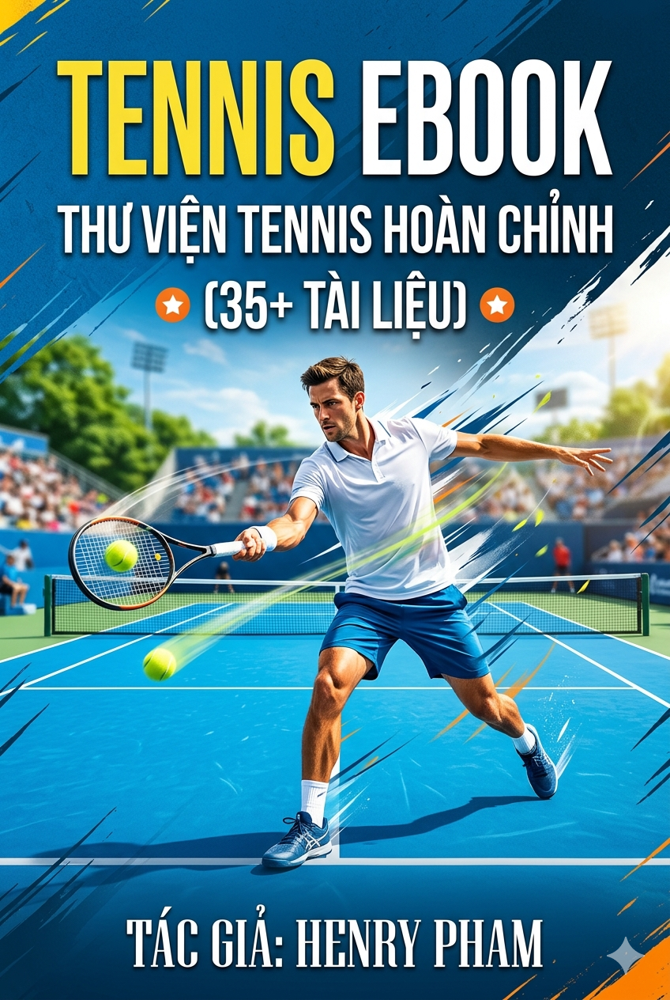

# 📚 Cẩm nang Tennis

> **5 bài viết** trong thư mục cẩm nang — sách dịch đầy đủ và bộ sưu tập ebook tennis song ngữ EN-VI để đọc offline.

**Tổng số file gốc:** 13 · **Loại TOC stub:** 8 · **Loại trùng lặp:** 0 · **Hiển thị:** 5

---

## Mục lục

- **📕 Sách & Cẩm nang đầy đủ** (4 bài + 📥 [tải EPUB](#tai-xuong-ebook-ay-u-epub))

---

## 📕 Sách & Cẩm nang đầy đủ

### 🎨 Thư Viện Hình Ảnh (38 sơ đồ infographic tennis)

[**👉 Mở Thư Viện Hình Ảnh ngay →**](thu-vien-hinh-anh/index.md){ .md-button }

38 sơ đồ infographic chất lượng cao — sinh học & chiến thuật tennis: **Forehand, Backhand, Serve, Footwork, Slice, Nền tảng, Chiến thuật**. Mỗi sơ đồ có Vietnamese + English title, mô tả chi tiết, và được phân loại theo cú đánh. Nhấp để xem ảnh đầy đủ.

*Tổng hợp ảnh với mô tả song ngữ — phong cách infographic giáo dục với ảnh player minh họa + sơ đồ vector + chú thích kỹ thuật EN-VI. Phù hợp cho cả HLV 3.5 → 5.0+ và người chơi muốn xem nhanh trước khi đọc sách dài.*

---

- [Modern Tennis Volley Handbook 2026](modern_tennis_volley_handbook_2026.md)
- [Nghệ Thuật Hiện Đại Tennis](the_art_of_modern_tennis.md)
- [The Art of Modern Tennis — A Complete Reference Manual](the-art-of-modern-tennis-a-complete-reference-manual-for-elite-players-and-coach.md)
- [📚 Tennis Ebook — Thư Viện Hoàn Chỉnh (35+ tài liệu)](https://henryphamduc.github.io/tennis-wiki/cam-nang/ebook/)

### 🎾 Tennis Ebook — Thư Viện Hoàn Chỉnh (35+ tài liệu)

👉 **[Đọc online ngay](https://henryphamduc.github.io/tennis-wiki/cam-nang/ebook/){ .md-button }** — Mở viewer ebook song ngữ EN-VI với sidebar nav + iframe cho từng tài liệu (35+ bài viết).

{ width="280" loading=lazy }

**Cẩm nang tennis toàn diện nhất** — tuyển tập **35+ tài liệu dài** về mọi mặt của quần vợt hiện đại: từ **cẩm nang tổng hợp**, **cơ sinh học & vận động học** (kinetic chain, GRF, wave theory), **forehand/backhand/serve/volley chuyên sâu** (phân tích 6 tay vợt đỉnh cao), đến **triết lý huấn luyện & chiến thuật** (70% Rule, 3-shot patterns, game management).

Dành cho HLV và người chơi từ **3.5 → 5.0+** — bản tiếng Việt song song EN-VI, định dạng EPUB mở (đọc trên Calibre, Apple Books, Google Play Books, Kindle). Bao gồm toàn bộ nội dung của 3 vault riêng biệt (Base / Advanced / Elite) gộp vào một file duy nhất.

*The most comprehensive tennis ebook — **35+ in-depth documents** covering everything from fundamentals to elite play: integrated manuals, biomechanics, stroke analysis, coaching philosophy, and tactics. Bilingual EN-VI, single EPUB file.*

---

### 📥 Tải xuống Ebook đầy đủ (EPUB)

> Bộ sưu tập **4 ebook tennis song ngữ EN-VI** — đọc offline trên máy đọc sách, tablet, hoặc app EPUB (Calibre, Apple Books, Google Play Books, Kindle).

| Ebook | Phù hợp | Dung lượng | Tải xuống |
|---|---|---|---|
| **Henry's Tennis Knowledge Vault** (bản gốc) | Người chơi 3.5, mới bắt đầu nghiêm túc | ~535 KB | [⬇ Tải EPUB](dl/tennis-vault.epub){ .md-button } |
| **Vault — Advanced Edition** | Người chơi 3.5 → 4.5 | ~213 KB | [⬇ Tải EPUB](dl/tennis-vault-advanced.epub){ .md-button } |
| **Vault — Elite Edition** | Người chơi 5.0+ | ~379 KB | [⬇ Tải EPUB](dl/tennis-vault-elite.epub){ .md-button } |
| **Tennis Ebook — Thư Viện Hoàn Chỉnh (35+ tài liệu)** | Toàn bộ 35+ tài liệu, đầy đủ nhất | ~3.6 MB | [⬇ Tải EPUB](dl/tennis-ebook-full.epub){ .md-button } |

### 📕 TFL Manuals — 35 tài liệu tennis chuyên sâu (HTML, đọc online)

> Bộ sưu tập **35 bài viết dài** về tennis — từ cẩm nang tổng hợp, cơ sinh học, forehand/backhand/serve/volley chi tiết, đến triết lý huấn luyện. Đọc trực tiếp trong trình duyệt (HTML).

#### 🎾 Sách tổng hợp & Cẩm nang hệ thống

- **[Cẩm Nang Tennis Hiện Đại — Full Formula 2026](tfl/CAM_NANG_TENNIS_HIEN_DAI_FULL_FORMULA_2026.html)** — Cẩm nang tổng hợp sinh cơ học, thần kinh học hiệu suất và ứng dụng AI cho tennis hiện đại. *(243.1 KB)*
- **[Quần Vợt Đỉnh Cao — Coach 5.0](tfl/Quan_Vot_Dinh_Cao_Coach_5.0.html)** — Cẩm nang toàn diện cho HLV cấp độ 5.0 — tâm lý, giải phẫu, forehand, serve, tactics. *(260.1 KB)*
- **[Modern Tennis Handbook](tfl/Modern_Tennis_Handbook.html)** — Handbook hiện đại theo trình tự học từ fundamentals → specialty → mastery. *(100.3 KB)*
- **[Tennis Handbook (Tiếng Việt)](tfl/tennis_handbook_vn.html)** — Cẩm nang tennis — hướng dẫn bỏ túi nâng cao toàn diện (bản tiếng Việt). *(64.5 KB)*
- **[Tennis Manual (Song Ngữ EN-VI)](tfl/tennis_manual_bilingual.html)** — Tennis manual song ngữ EN-VI — technical reference chính. *(96.0 KB)*
- **[Tennis Mastery](tfl/tennis_mastery.html)** — Hệ thống huấn luyện chuyên sâu cho VĐV tennis cấp 5.0. *(157.4 KB)*
- **[Tennis Mastery (20 Chapters)](tfl/Tennis_Mastery_20_Chapters.html)** — The complete system for doubles strategy & footwork (20 chapters). *(55.1 KB)*
- **[Tennis Mastery — Complete](tfl/Tennis_Mastery_Complete.html)** — Từ cơ sinh học hiện đại đến triết lý Nội Gia — toàn tập tennis mastery. *(165.0 KB)*
- **[Tennis Mastery — Hướng Dẫn Tiếng Việt](tfl/tennis_mastery_guide_tieng_viet.html)** — Cẩm nang tennis: nền tảng → kỹ thuật nâng cao → cú đánh đặc biệt → phá vỡ giới hạn. *(39.2 KB)*
- **[The Art of Modern Tennis (Polished Edition)](tfl/The_Art_of_Modern_Tennis_Polished.html)** — Complete reference manual cho VĐV và HLV tennis đẳng cấp — bản polished. *(341.6 KB)*

#### 🦴 Cơ sinh học & Vận động học

- **[Cơ Sinh Học Tennis Hiện Đại](tfl/Co_Sinh_Hoc_Tennis_Hien_Dai.html)** — Phân tích chuyên sâu hệ thống vận động Elite — nền tảng tiếp đất, GRF, bộ chân. *(86.9 KB)*
- **[Tennis Biomechanics 5.0 — Complete](tfl/Tennis_Biomechanics_5.0_Complete.html)** — Giải phẫu chức năng và góc khớp của VĐV tennis đẳng cấp 5.0. *(148.5 KB)*
- **[Kỹ Thuật Chân Tennis](tfl/Ky_Thuat_Chan_Tennis.html)** — Kỹ thuật chân tennis — nền tảng sinh cơ học cho mọi cú đánh. *(84.8 KB)*
- **[Nguyên Lý Tam Duỗi Trong Tennis](tfl/nguyen-ly-tam-duoi-tennis.html)** — Cơ chế đàn hồi ba khớp của cánh tay đánh bóng — nền tảng sinh cơ học. *(87.2 KB)*
- **[Tennis Ballet (20 Chương)](tfl/Tennis_Ballet_20_Chuong.html)** — Bí mật di chuyển của Federer, Nadal và Alcaraz — triết lý ballet trong tennis. *(63.2 KB)*
- **[Racket Face Angle & Grip-Rotation Mechanics](tfl/racket_face_angle_research.html)** — Phân tích biomechanics giữa grip, forearm rotation và racket face angle. *(36.2 KB)*

#### 🧠 Hệ thống & Triết lý huấn luyện

- **[Hệ Song Trong Tennis](tfl/He_Song_Trong_Tennis.html)** — Sự hội tụ giữa khoa học sinh cơ học và triết lý Thái Cực trong tennis. *(134.4 KB)*
- **[Hệ Thống Tennis Cấp Cao (20 Chương)](tfl/He_Thong_Tennis_Cap_Cao_20_Chuong.html)** — Cẩm nang huấn luyện 20 chương cho vận động viên cấp 5.0. *(158.1 KB)*
- **[GOAT Tennis — Giáo Trình Tiếng Việt](tfl/GOAT_Tennis_Giao_Trinh_Tieng_Viet.html)** — Giáo trình tennis chuyên nghiệp toàn diện — hệ thống GOAT. *(191.2 KB)*
- **[Tinh Khí Thần Tennis 5.0](tfl/TinhKhiThan_Tennis_5.0.html)** — Hệ thống toàn diện Tinh Khí Thần — cho HLV và VĐV tennis cấp cao. *(113.9 KB)*
- **[Vì Nhận Thức Cơ Thể — Tennis 20 Chương](tfl/Vi_Nhan_Thuc_Co_The_Tennis_20_Chuong.html)** — Proprioception — nền tảng ẩn của tennis đỉnh cao (20 chương). *(156.6 KB)*
- **[The Neurological Edge — Professional Manual](tfl/The_Neurological_Edge_Professional_Manual.html)** — The kinetic chain and biomechanical foundations — neurological edge. *(263.2 KB)*
- **[Cẩm Nang Đào Tạo Tennis 50+](tfl/Cam_Nang_Dao_Tao_Tennis_50_Plus.html)** — Chương trình huấn luyện 5 năm cho người bắt đầu/tái khởi động tennis sau tuổi 50. *(111.2 KB)*
- **[Song Trong Tennis — Manual](tfl/Song-Trong-Tennis-Manual.html)** — Ứng dụng khoa học thần kinh vào hiệu suất tennis. *(79.1 KB)*

#### 🎯 Forehand / Backhand / Serve / Volley chi tiết

- **[Nghệ Thuật Forehand Tennis](tfl/Nghe_thuat_forehand_tennis.html)** — Phân tích kỹ thuật forehand của 6 tay vợt đỉnh cao — Rublev, Fonseca, Sinner, Alcaraz, Federer, Djokovic. *(70.9 KB)*
- **[One-Handed Backhand Mastery](tfl/One_Handed_Backhand_Mastery.html)** — Phân tích kỹ thuật chuyên sâu cho người chơi Level 3.5+ — One-Handed Backhand. *(132.0 KB)*
- **[Kỹ Thuật Trái Tay Một Tay (10 Chương)](tfl/KyThuat_TraiTay_MotTay_10Chuong.html)** — Giáo trình sinh cơ học toàn diện cho người chơi Level 3.5 — One-Handed Backhand. *(73.5 KB)*
- **[Cú Trái Tay Một Tay](tfl/cu_trai_tay_mot_tay.html)** — Hướng dẫn toàn diện cú trái tay một tay cho người chơi Level 3.5. *(94.7 KB)*
- **[Tennis Serve Guide](tfl/tennis_serve_guide.html)** — Xoắn tối đa, gối an toàn — chuỗi động học từ mặt đất đến đầu vợt. *(29.9 KB)*
- **[Nghệ Thuật Giao Bóng Tennis](tfl/Nghe_Thuat_Giao_Bong_Tennis.html)** — Hệ thống toàn diện giúp người chơi tennis nâng cao hiệu quả giao bóng. *(79.6 KB)*
- **[Phân Tích Kỹ Thuật Giao Bóng — Top WTA](tfl/Phan_Tich_Ky_Thuat_Giao_Bong_WTA.html)** — Phân tích 10 cú giao bóng tại Indian Wells — Sabalenka, Gauff, Andreeva, Swiatek, Raducanu. *(60.1 KB)*
- **[Complete Volley Manual](tfl/Complete_Volley_Manual.html)** — Three weapons, not one — biomechanics chi tiết cho net play (half-volley, swing volley, punch volley). *(59.0 KB)*
- **[Cẩm Nang Volley Toàn Diện 2026](tfl/CamNang_Volley_ToanDien_2026.html)** — Hướng dẫn chuyên sâu về kỹ thuật Volley hiện đại — dành cho người chơi 40–55 tuổi. *(44.0 KB)*

#### 📚 Coaching, Tactics & Game Management

- **[Tennis Coaching (Người Nghiệp Dư)](tfl/tennis_coaching_nguoi_nghiep_du.html)** — Cẩm nang toàn diện cho HLV tennis nghiệp dư. *(130.7 KB)*
- **[Tennis Game Management](tfl/tennis_game_management.html)** — Hệ thống chiến lược toàn diện cho cấp độ 5.0 — quản lý game. *(147.8 KB)*

---

📅 Cập nhật: 2026-06-29 · Tổng số bài: **5** (loại 8 TOC stub và 0 trùng lặp từ 13 file gốc)

[← Về trang chủ](../index.md)