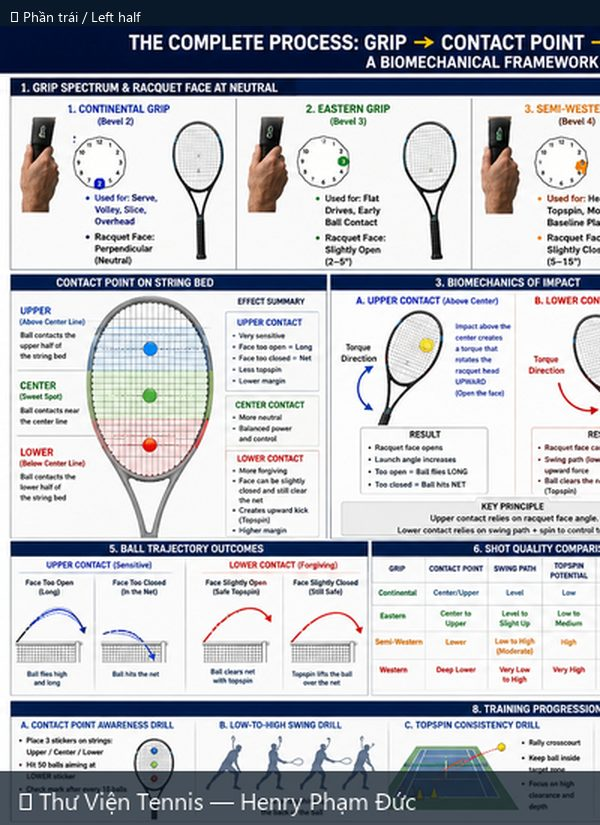
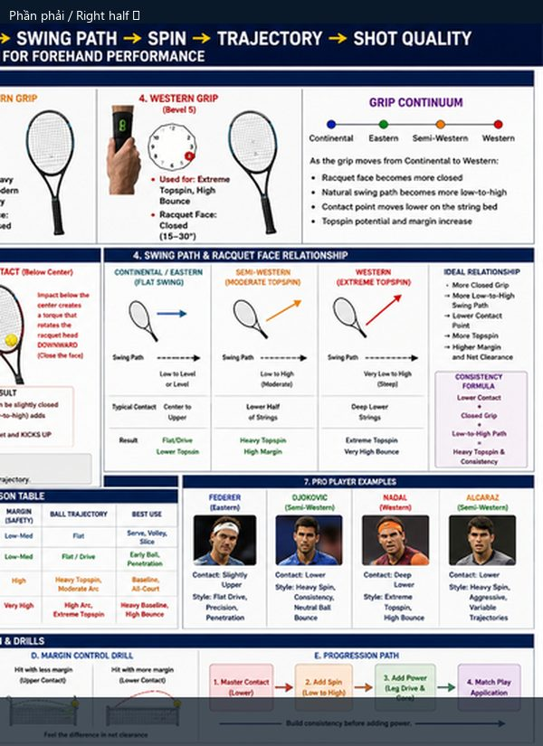

# Quy Trình Hoàn Chỉnh: Cầm Vợt → Điểm Tiếp Xúc → Đường Vung → Xoáy → Quỹ Đạo

> *Complete Process: Grip → Contact → Swing → Spin → Trajectory*

**Chủ đề:** Forehand · **Nguồn:** ChatGPT Image Generator · **Bộ sưu tập:** Thư Viện Hình Ảnh Tennis

---

## 📷 Sơ đồ đầy đủ / Full Diagram

📂 **[Xem file gốc / View source PNG](../../../assets/thu-vien/complete_process_forehand_biomechanics.png)**

---

## 🔍 Zoom chi tiết / Detail Zoom

### Trái / Left half

### Phải / Right half

---

## 📝 Mô tả chi tiết / Detailed Description

| 🇻🇳 Tiếng Việt | 🇺🇸 English |
|---|---|
| Phân tích sinh học toàn diện cho forehand. 8 phần: phổ grip (Continental → Western), điểm tiếp xúc (upper/center/lower), biomechanics lực đánh, swing path + mặt vợt, quỹ đạo bóng, so sánh chất lượng cú đánh, ví dụ tay vợt pro (Federer, Djokovic, Nadal, Alcaraz), tiến trình tập luyện. | Comprehensive biomechanical framework for forehand. 8 sections: grip spectrum, contact point, impact biomechanics, swing path + face relationship, ball trajectories, shot quality table, pro player examples, training progression. |

---

## 🔗 Liên kết / Related Links

- ⬅️ **[← Quay lại Thư Viện Hình Ảnh](../index.md)**
- 🎯 **[Tổng quan Cẩm nang Tennis](../../index.md)**
- 📘 **[Tennis Manual (Master Reference v2)](https://henryphamduc.github.io/tennis/)**

---

Sơ đồ được tạo từ ChatGPT Image Generator · Watermarked & shipped by Henry Phạm Đức · 2026-06-29
