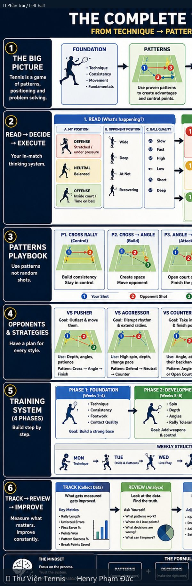
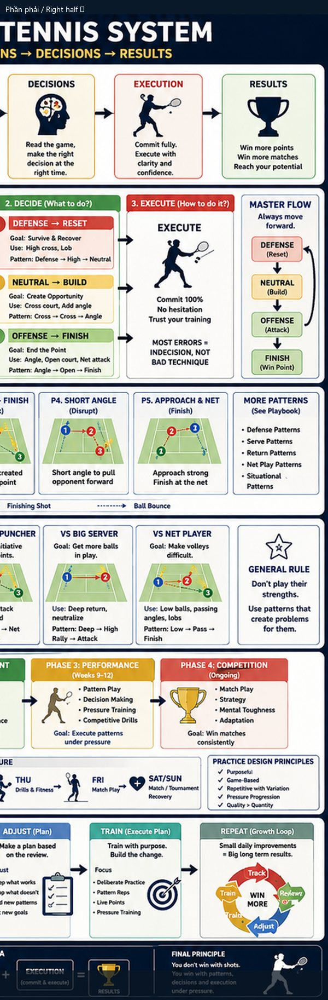

# Hệ Thống Tennis Hoàn Chỉnh: Kỹ Thuật → Mẫu → Quyết Định → Kết Quả

> *The Complete Tennis System: Technique → Patterns → Decisions → Results*

**Chủ đề:** Strategy · **Nguồn:** ChatGPT Image Generator · **Bộ sưu tập:** Thư Viện Hình Ảnh Tennis

---

## 📷 Sơ đồ đầy đủ / Full Diagram

📂 **[Xem file gốc / View source PNG](../../../assets/thu-vien/complete_tennis_system_technique_patterns_decisions_results.png)**

---

## 🔍 Zoom chi tiết / Detail Zoom

### Trái / Left half

### Phải / Right half

---

## 📝 Mô tả chi tiết / Detailed Description

| 🇻🇳 Tiếng Việt | 🇺🇸 English |
|---|---|
| Hệ thống meta (không phải cú đánh cụ thể). Big picture: Foundation → Patterns → Decisions → Execution → Results. Read-Decide-Execute 3 cột. 5 mẫu chiến thuật chính (Cross rally, Cross→Angle, Angle→Finish, Short angle, Approach & Net). Chiến lược vs 5 đối thủ (Pusher, Aggressor, Counterpuncher, Big Server, Net Player). Hệ thống tập 4 pha. Track-Review-Improve loop. | Meta-system (not a stroke). Foundation → Patterns → Decisions → Execution → Results. 3-column Read/Decide/Execute. 5 core patterns. Strategy vs 5 opponent types. 4-phase training system. Track-Review-Improve loop. |

---

## 🔗 Liên kết / Related Links

- ⬅️ **[← Quay lại Thư Viện Hình Ảnh](../index.md)**
- 🎯 **[Tổng quan Cẩm nang Tennis](../../index.md)**
- 📘 **[Tennis Manual (Master Reference v2)](https://henryphamduc.github.io/tennis/)**

---

Sơ đồ được tạo từ ChatGPT Image Generator · Watermarked & shipped by Henry Phạm Đức · 2026-06-29
