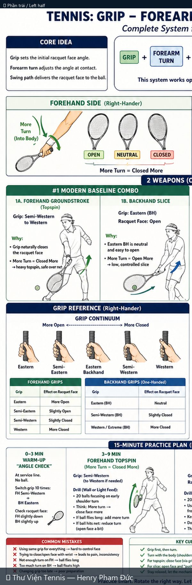
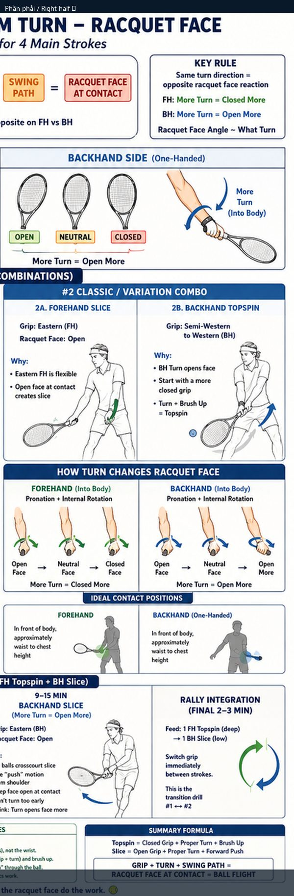

# Cầm Vợt – Xoay Cẳng Tay – Mặt Vợt: 4 Cú Đánh Chính

> *Grip – Forearm Turn – Racquet Face for 4 Main Strokes*

**Chủ đề:** Fundamentals · **Nguồn:** ChatGPT Image Generator · **Bộ sưu tập:** Thư Viện Hình Ảnh Tennis

---

## 📷 Sơ đồ đầy đủ / Full Diagram

📂 **[Xem file gốc / View source PNG](../../../assets/thu-vien/grip_forearm_turn_racquet_face_4_strokes.png)**

---

## 🔍 Zoom chi tiết / Detail Zoom

### Trái / Left half

### Phải / Right half

---

## 📝 Mô tả chi tiết / Detailed Description

| 🇻🇳 Tiếng Việt | 🇺🇸 English |
|---|---|
| Hệ thống hoàn chỉnh kiểm soát mặt vợt. Công thức cốt lõi: Grip + Forearm turn + Swing path = Mặt vợt tại tiếp xúc. Quy tắc FH vs BH đối lập (FH: more turn = closed more; BH: more turn = open more). 4 cú đánh: FH topspin, BH slice, FH slice, BH topspin. Bảng grip continuum (Eastern → Western). | Complete system for racquet face control. Core formula: Grip + Forearm turn + Swing path = Face at contact. FH and BH turn rules are opposite. 4 stroke combinations + grip continuum reference. 15-minute practice plan. |

---

## 🔗 Liên kết / Related Links

- ⬅️ **[← Quay lại Thư Viện Hình Ảnh](../index.md)**
- 🎯 **[Tổng quan Cẩm nang Tennis](../../index.md)**
- 📘 **[Tennis Manual (Master Reference v2)](https://henryphamduc.github.io/tennis/)**

---

Sơ đồ được tạo từ ChatGPT Image Generator · Watermarked & shipped by Henry Phạm Đức · 2026-06-29
