# 🎨 Thư Viện Hình Ảnh Tennis

> **Visual Coaching Library — 42 sơ đồ sinh học & chiến thuật tennis**
>
> Tổng hợp **42 sơ đồ infographic** chất lượng cao từ chuỗi nghiên cứu sinh học và chiến thuật tennis (16 từ ChatGPT + 26 từ Gemini). Mỗi sơ đồ có **trang riêng** với ảnh full + zoom chi tiết (trái/phải) + mô tả song ngữ EN-VI.
---

## 📊 Tổng quan

| 🇻🇳 Tiếng Việt | 🇺🇸 English |
|---|---|
| Thư viện **42 sơ đồ tennis** được sắp xếp theo **7 chủ đề** (16 ChatGPT + 26 Gemini). Mỗi sơ đồ → trang detail riêng với ảnh full + 2 crops (trái/phải) + mô tả song ngữ. | Visual library of **42 tennis diagrams** organized into **7 categories** (16 ChatGPT + 26 Gemini). Each diagram → dedicated detail page with full image + 2 crops (left/right) + bilingual description. |

**Tổng sơ đồ:** 42 (16 ChatGPT + 26 Gemini) • **Tổng trang detail:** 42 • **Tổng ảnh embed:** 126 (1 full + 2 crops per diagram) • **Nguồn:** ChatGPT Image Generator (2026-06-28) + Google Gemini Image Generator (2026-06-29)

---

## 🗂️ Mục lục nhanh / Quick Navigation

- 🎯 **[Forehand (Thuận tay)](#forehand)** — Forehand (7 sơ đồ / diagrams)
- ↩️ **[Backhand (Trái tay)](#backhand)** — Backhand (4 sơ đồ / diagrams)
- 🚀 **[Serve (Giao bóng)](#serve)** — Serve (6 sơ đồ / diagrams)
- 🦶 **[Footwork & Kinetic Chain](#footwork)** — Footwork (7 sơ đồ / diagrams)
- ✋ **[Nền tảng kỹ thuật](#fundamentals)** — Fundamentals (3 sơ đồ / diagrams)
- 🔪 **[Slice (Bóng xoáy âm)](#slice)** — Slice (2 sơ đồ / diagrams)
- 🧠 **[Chiến thuật & Tư duy](#strategy)** — Strategy & Mental (13 sơ đồ / diagrams)

---

## 🎯 Forehand (Thuận tay) / Forehand

**7 sơ đồ trong chủ đề — **Forehand** diagrams**

Click thumbnail để mở trang detail (với ảnh full + zoom crops).

<a href="complete_process_forehand_biomechanics/" class="gallery-card">

  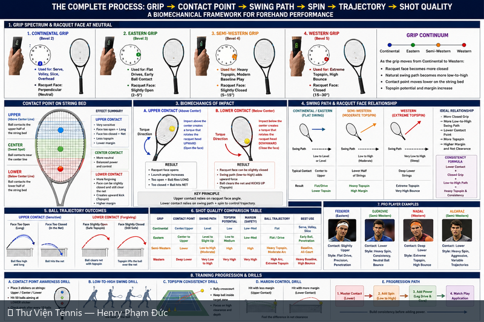

  <strong>Quy Trình Hoàn Chỉnh: Cầm Vợt → Điểm Tiếp Xúc → Đường Vung → Xoáy → Quỹ Đạo 🅒</strong>

  <em>Complete Process: Grip → Contact → Swing → Spin → Trajectory</em>

</a>

<a href="racquet_head_speed_drop_figure8_45whip/" class="gallery-card">

  

  <strong>Quy Trình Tạo Tốc Độ Đầu Vợt — Drop • Figure-8 • 45° Whip 🅒</strong>

  <em>Racquet Head Speed Process — Drop • Figure-8 • 45° Whip</em>

</a>

<a href="rotational_vs_linear_engine_open_vs_closed_stance/" class="gallery-card">

  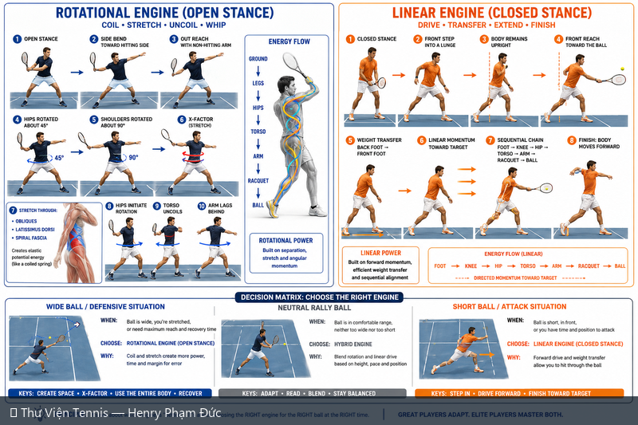

  <strong>Động Cơ Xoay vs Động Cơ Tuyến — Open vs Closed Stance 🅒</strong>

  <em>Rotational Engine vs Linear Engine — Open vs Closed Stance</em>

</a>

<a href="complete_process_forehand_grip_contact/" class="gallery-card">

  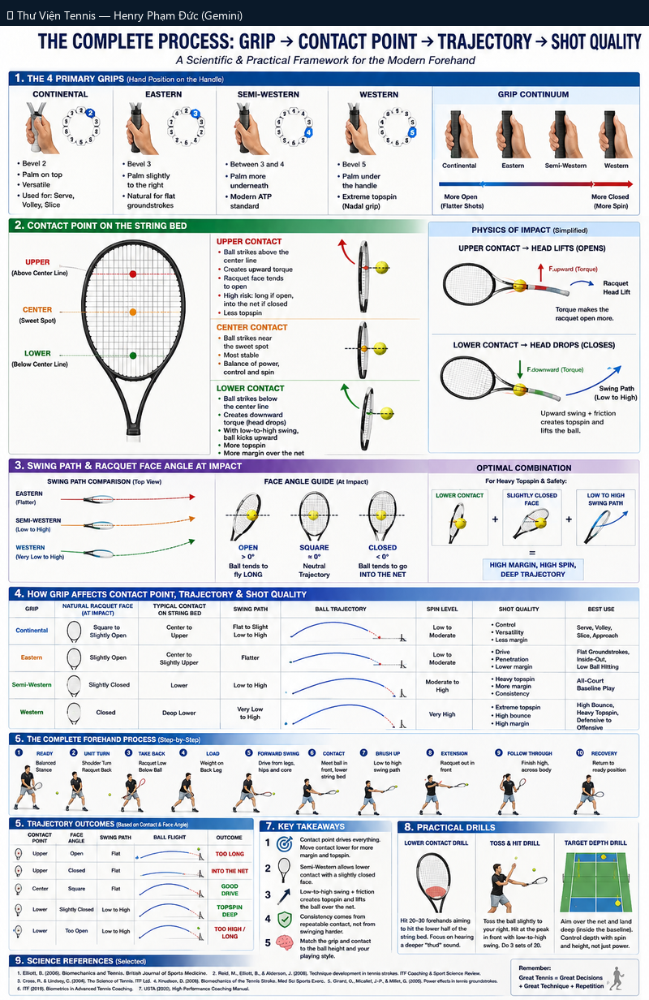

  <strong>Quy Trình Hoàn Chỉnh: Cầm Vợt → Điểm Tiếp Xúc → Quỹ Đạo → Chất Lượng Cú Đánh 🅖</strong>

  <em>Complete Process: Grip → Contact → Trajectory → Shot Quality</em>

</a>

<a href="full_process_coil_load_uncoil_release/" class="gallery-card">

  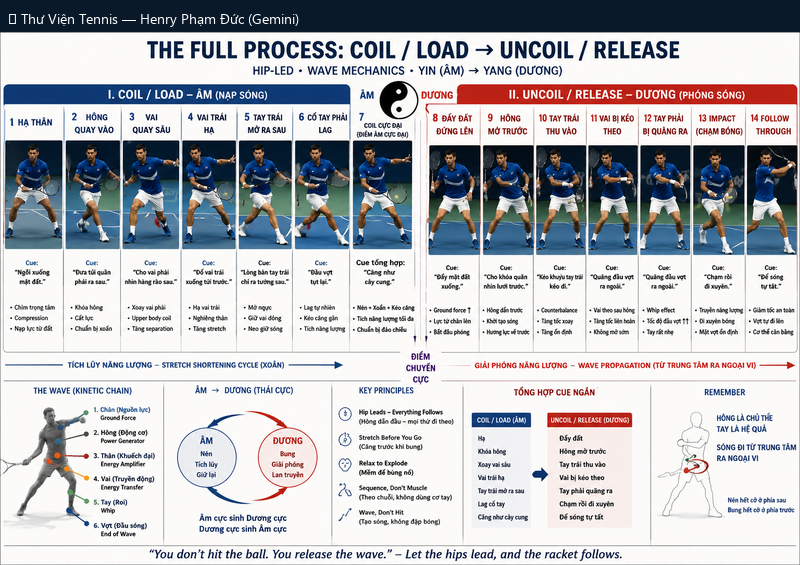

  <strong>Quy Trình Hoàn Chỉnh: Coil / Load → Uncoil / Release (Hip-Led Wave Mechanics) 🅖</strong>

  <em>Full Process: Coil / Load → Uncoil / Release (Hip-Led Wave Mechanics)</em>

</a>

<a href="g_racquet_head_speed_drop_figure8_45whip/" class="gallery-card">

  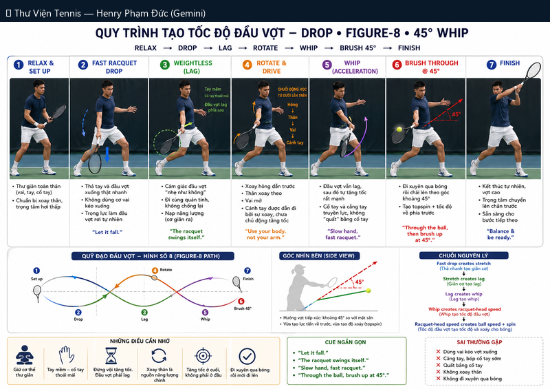

  <strong>Quy Trình Tạo Tốc Độ Đầu Vợt: Drop • Figure-8 • 45° Whip 🅖</strong>

  <em>Racquet Head Speed Process: Drop • Figure-8 • 45° Whip</em>

</a>

<a href="rotational_vs_linear_engine_open_vs_closed/" class="gallery-card">

  

  <strong>Động Cơ Xoay vs Động Cơ Tuyến: Open Stance vs Closed Stance 🅖</strong>

  <em>Rotational Engine vs Linear Engine: Open Stance vs Closed Stance</em>

</a>

---

🅒 = ChatGPT · 🅖 = Gemini

## ↩️ Backhand (Trái tay) / Backhand

**4 sơ đồ trong chủ đề — **Backhand** diagrams**

Click thumbnail để mở trang detail (với ảnh full + zoom crops).

<a href="master_two_handed_backhand_complete_system/" class="gallery-card">

  

  <strong>Master Backhand Hai Tay — Hệ Thống Cơ Sinh Học Hoàn Chỉnh 🅒</strong>

  <em>Master Two-Handed Backhand — The Complete Biomechanical System</em>

</a>

<a href="one_handed_backhand_essential_process/" class="gallery-card">

  

  <strong>Backhand Một Tay — Quy Trình Cốt Lõi 🅒</strong>

  <em>One-Handed Backhand — The Essential Process</em>

</a>

<a href="two_handed_backhand_biomechanics_sequential/" class="gallery-card">

  

  <strong>Cơ Sinh Học Backhand Hai Tay — Trình Tự Hoàn Chỉnh 🅒</strong>

  <em>Two-Handed Backhand Biomechanics — Sequential Breakdown</em>

</a>

<a href="g_one_handed_backhand_essential_process/" class="gallery-card">

  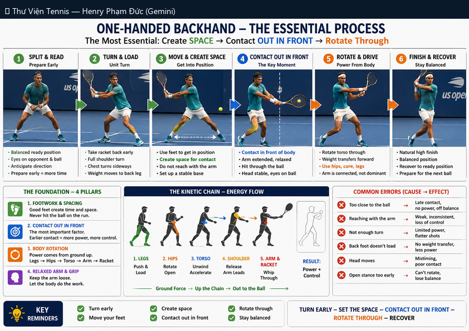

  <strong>Backhand Một Tay – Quy Trình Cốt Lõi (Tạo Không Gian → Tiếp Xúc Phía Trước → Xoay) 🅖</strong>

  <em>One-Handed Backhand – The Essential Process (Create Space → Contact Out Front → Rotate)</em>

</a>

---

🅒 = ChatGPT · 🅖 = Gemini

## 🚀 Serve (Giao bóng) / Serve

**6 sơ đồ trong chủ đề — **Serve** diagrams**

Click thumbnail để mở trang detail (với ảnh full + zoom crops).

<a href="cam_nang_giao_bong_4_phases/" class="gallery-card">

  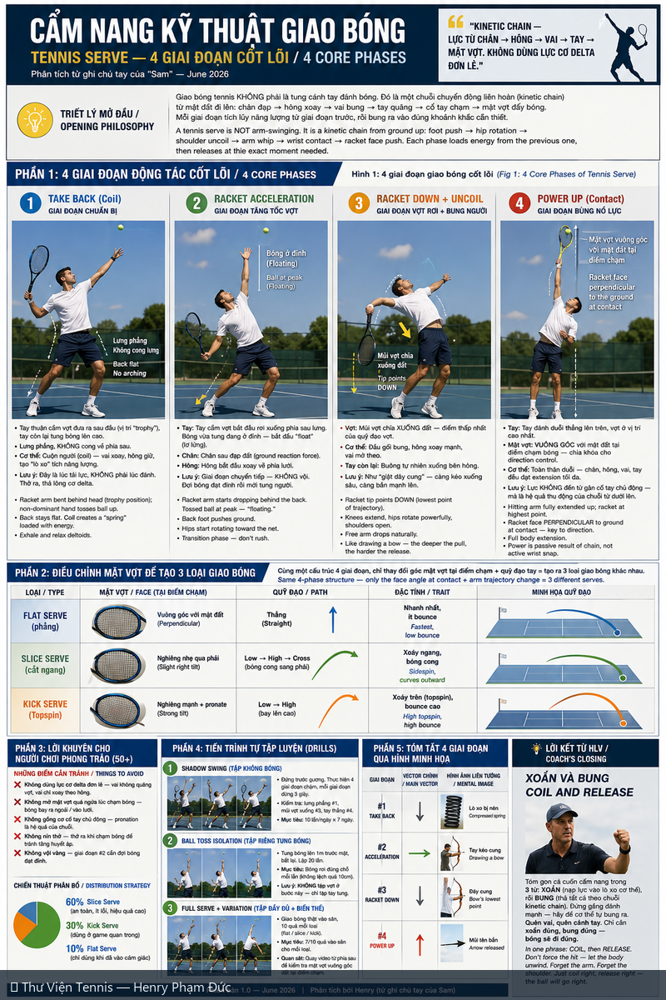

  <strong>Cẩm Nang Kỹ Thuật Giao Bóng — 4 Giai Đoạn Cốt Lõi 🅒</strong>

  <em>Tennis Serve Manual — 4 Core Phases</em>

</a>

<a href="tennis_serve_frame_by_frame_shelton_djokovic_nadal/" class="gallery-card">

  

  <strong>Phân Tích Cú Giao Bóng Từng Khung Hình — Shelton vs Djokovic vs Nadal 🅒</strong>

  <em>Tennis Serve Frame-by-Frame Biomechanics — Shelton vs Djokovic vs Nadal</em>

</a>

<a href="kinetic_chain_spiral_serve_ground_up/" class="gallery-card">

  

  <strong>Kinetic Chain & Spiral Process Trong Tennis Serve: Build → Load → Unwind → Release 🅖</strong>

  <em>Kinetic Chain & Spiral Process in Tennis Serve (Build → Load → Unwind → Release)</em>

</a>

<a href="knee_biomechanics_serve_process_overview/" class="gallery-card">

  

  <strong>Cơ Sinh Học Đầu Gối Trong Tennis Serve – Process Overview 🅖</strong>

  <em>Knee Biomechanics in Tennis Serve – Process Overview</em>

</a>

<a href="knee_complete_process_serve/" class="gallery-card">

  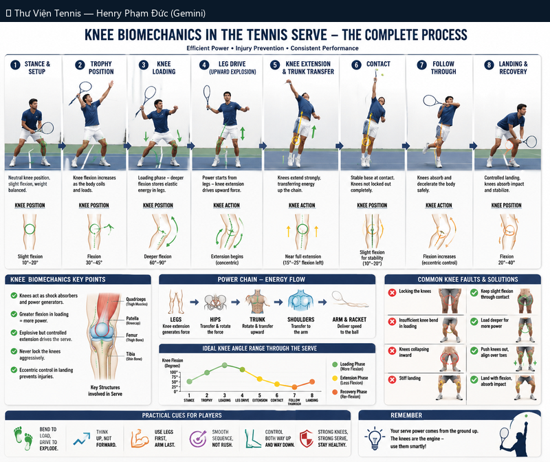

  <strong>Cơ Sinh Học Đầu Gối Trong Tennis Serve – Quy Trình Hoàn Chỉnh 🅖</strong>

  <em>Knee Biomechanics in the Tennis Serve – The Complete Process</em>

</a>

<a href="serve_frame_by_frame_shelton_djokovic_nadal/" class="gallery-card">

  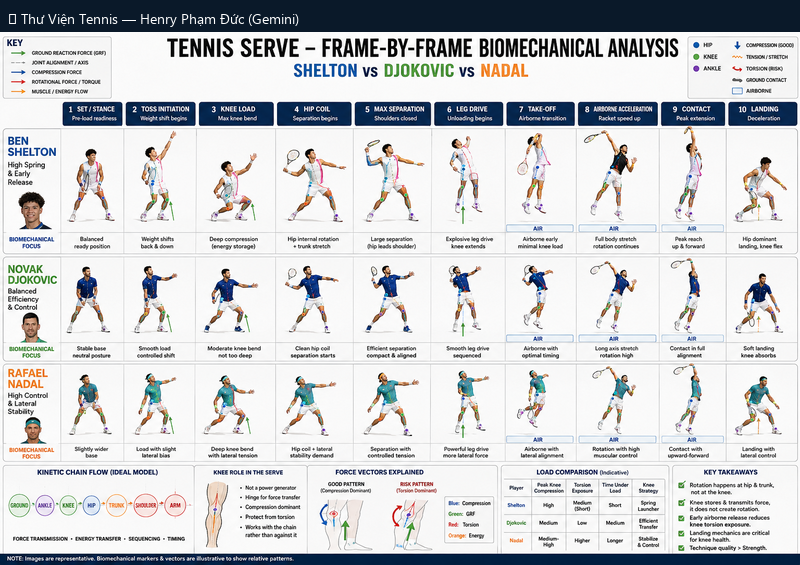

  <strong>Tennis Serve – Phân Tích Từng Khung Hình: Shelton vs Djokovic vs Nadal 🅖</strong>

  <em>Tennis Serve – Frame-by-Frame Biomechanical Analysis (Shelton / Djokovic / Nadal)</em>

</a>

---

🅒 = ChatGPT · 🅖 = Gemini

## 🦶 Footwork & Kinetic Chain / Footwork

**7 sơ đồ trong chủ đề — **Footwork** diagrams**

Click thumbnail để mở trang detail (với ảnh full + zoom crops).

<a href="footwork_kinetic_chain_complete_process/" class="gallery-card">

  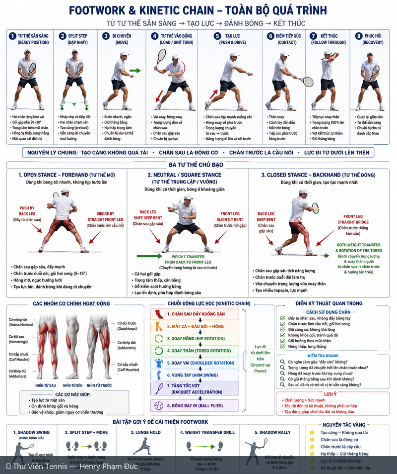

  <strong>Bước Chân & Chuỗi Động Lực — Toàn Bộ Quá Trình 🅒</strong>

  <em>Footwork & Kinetic Chain — The Complete Process</em>

</a>

<a href="split_step_complete_process/" class="gallery-card">

  

  <strong>Split Step — Quy Trình Hoàn Chỉnh 🅒</strong>

  <em>Split Step — The Complete Process</em>

</a>

<a href="force_transmission_heel_to_hand/" class="gallery-card">

  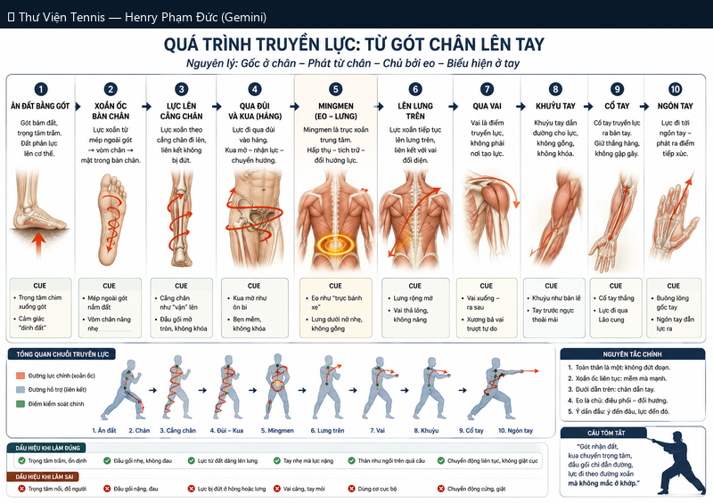

  <strong>Quá Trình Truyền Lực: Từ Gót Chân Lên Tay 🅖</strong>

  <em>Force Transmission Process: From Heel to Hand</em>

</a>

<a href="kinetic_chain_tennis_ground_to_racket/" class="gallery-card">

  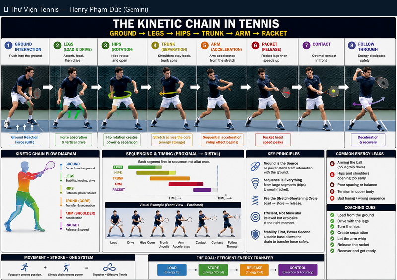

  <strong>The Kinetic Chain In Tennis: Ground → Legs → Hips → Trunk → Arm → Racket 🅖</strong>

  <em>The Kinetic Chain in Tennis (Ground → Legs → Hips → Trunk → Arm → Racket)</em>

</a>

<a href="knee_time_gate_kinetic_chain/" class="gallery-card">

  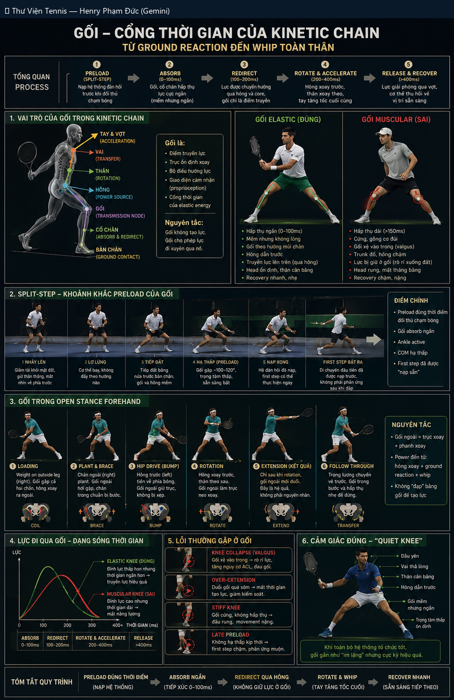

  <strong>Gối – Cổng Thời Gian Của Kinetic Chain (Từ Ground Reaction Đến Whip) 🅖</strong>

  <em>Knee – The Time Gate of the Kinetic Chain (from GRF to Whip)</em>

</a>

<a href="spiral_chain_heel_mingmen_hand/" class="gallery-card">

  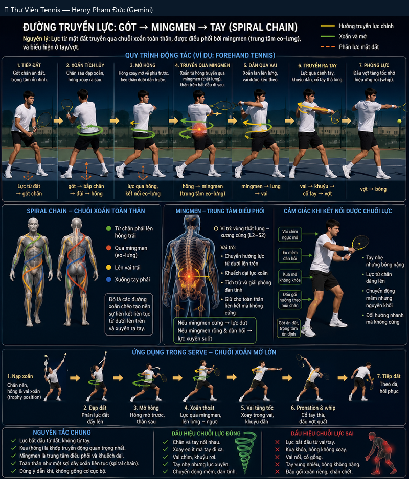

  <strong>Đường Truyền Lực: Gót → Mingmen → Tay (Spiral Chain) 🅖</strong>

  <em>Force Transmission Path: Heel → Mingmen → Hand (Spiral Chain)</em>

</a>

<a href="universal_footwork_process_standard_prep/" class="gallery-card">

  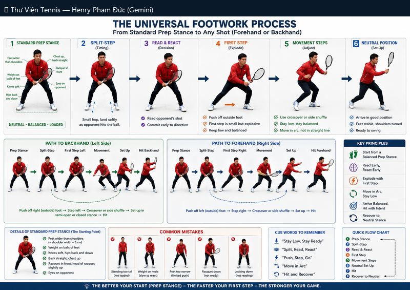

  <strong>Quy Trình Footwork Phổ Quát: Từ Tư Thế Chuẩn Bị Đến Mọi Cú Đánh 🅖</strong>

  <em>Universal Footwork Process: From Standard Prep Stance to Any Shot</em>

</a>

---

🅒 = ChatGPT · 🅖 = Gemini

## ✋ Nền tảng kỹ thuật / Fundamentals

**3 sơ đồ trong chủ đề — **Fundamentals** diagrams**

Click thumbnail để mở trang detail (với ảnh full + zoom crops).

<a href="grip_forearm_turn_racquet_face_4_strokes/" class="gallery-card">

  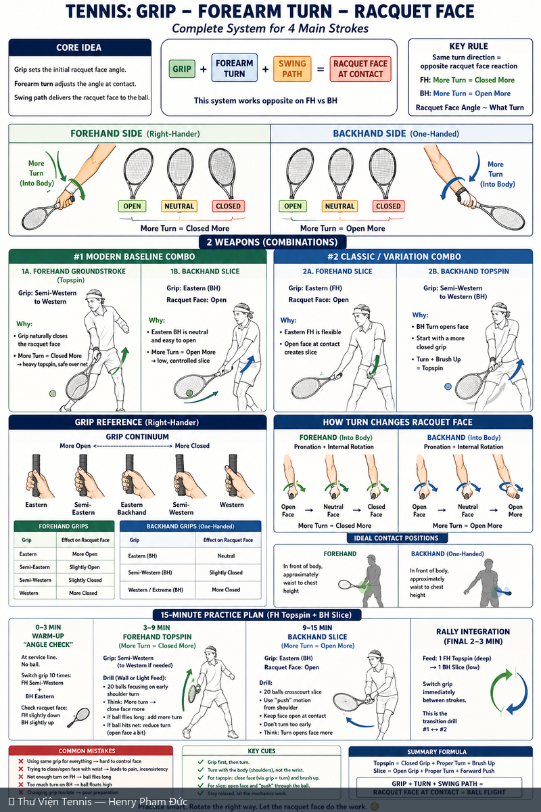

  <strong>Cầm Vợt – Xoay Cẳng Tay – Mặt Vợt: 4 Cú Đánh Chính 🅒</strong>

  <em>Grip – Forearm Turn – Racquet Face for 4 Main Strokes</em>

</a>

<a href="g_grip_forearm_turn_racquet_face_4_strokes/" class="gallery-card">

  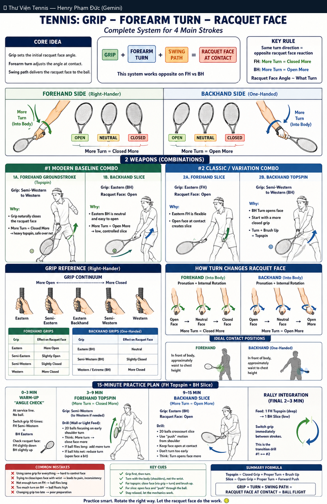

  <strong>Grip – Forearm Turn – Racquet Face: Hệ Thống Cho 4 Cú Đánh Chính 🅖</strong>

  <em>Grip – Forearm Turn – Racquet Face: Complete System for 4 Main Strokes</em>

</a>

<a href="neuromechanical_process_tennis_stroke/" class="gallery-card">

  

  <strong>Quá Trình Cơ Sinh Học Thần Kinh Của Cú Đánh Tennis 🅖</strong>

  <em>Neuromechanical Process of a Tennis Stroke (From Perception to Performance)</em>

</a>

---

🅒 = ChatGPT · 🅖 = Gemini

## 🔪 Slice (Bóng xoáy âm) / Slice

**2 sơ đồ trong chủ đề — **Slice** diagrams**

Click thumbnail để mở trang detail (với ảnh full + zoom crops).

<a href="returning_low_balls_slice_supination_pronation/" class="gallery-card">

  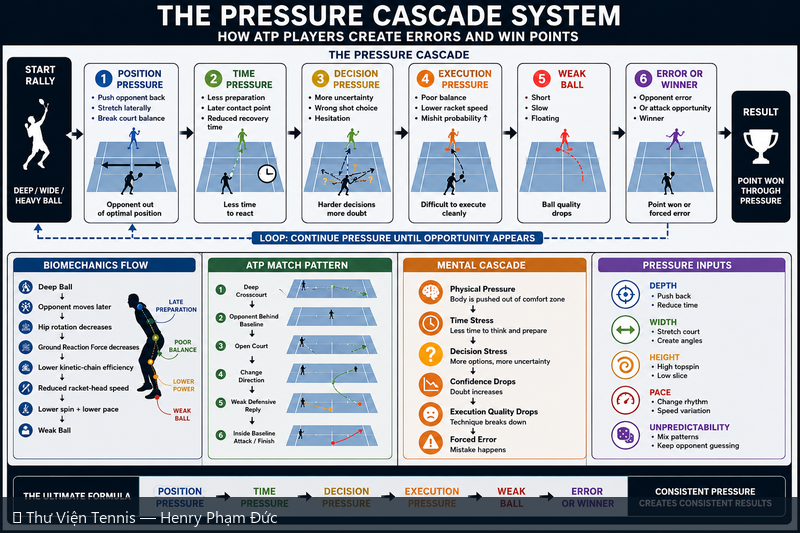

  <strong>Trả Bóng Thấp: FH Slice (Supination) & BH Slice (Pronation) 🅒</strong>

  <em>Returning Low Balls: FH Slice (Supination) + BH Slice (Pronation)</em>

</a>

<a href="returning_low_balls_fh_bh_slice/" class="gallery-card">

  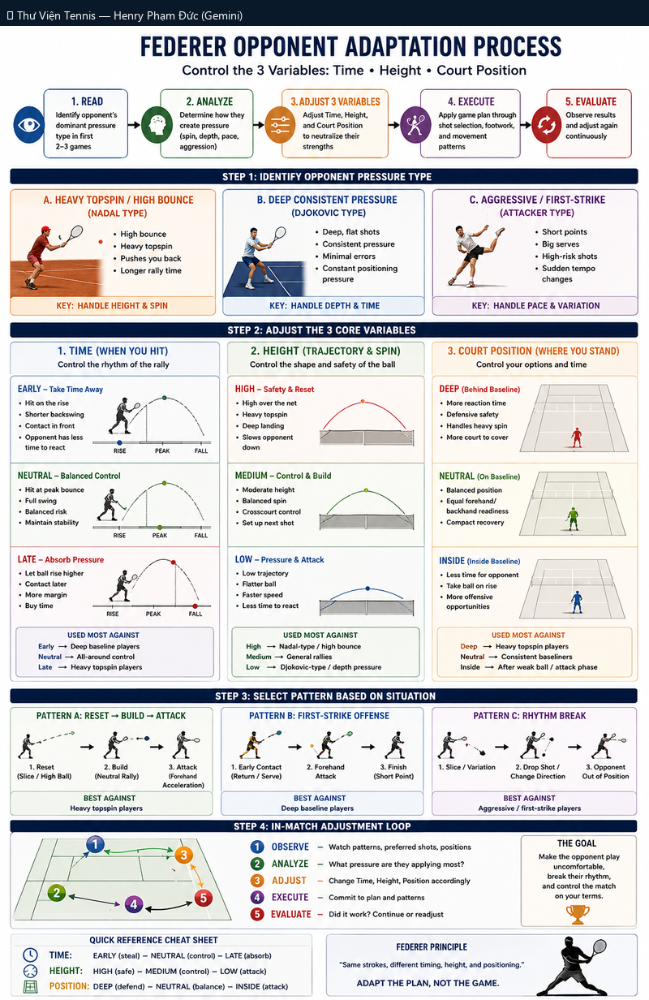

  <strong>Trả Bóng Thấp: Forehand Slice (Supination) & Backhand Slice (Pronation) 🅖</strong>

  <em>Returning Low Balls: Forehand Slice (with Supination) and Backhand Slice (with Pronation)</em>

</a>

---

🅒 = ChatGPT · 🅖 = Gemini

## 🧠 Chiến thuật & Tư duy / Strategy & Mental

**13 sơ đồ trong chủ đề — **Strategy & Mental** diagrams**

Click thumbnail để mở trang detail (với ảnh full + zoom crops).

<a href="complete_tennis_system_technique_patterns_decisions_results/" class="gallery-card">

  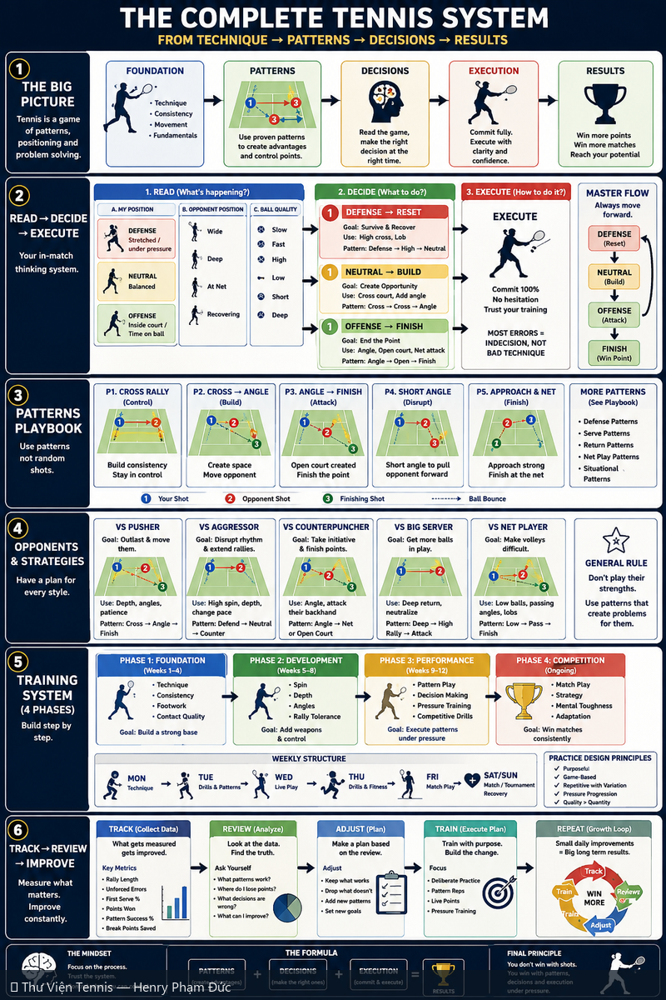

  <strong>Hệ Thống Tennis Hoàn Chỉnh: Kỹ Thuật → Mẫu → Quyết Định → Kết Quả 🅒</strong>

  <em>The Complete Tennis System: Technique → Patterns → Decisions → Results</em>

</a>

<a href="exposed_angles_geometry_court_control/" class="gallery-card">

  

  <strong>Góc Mở Trong Tennis — Hình Học Kiểm Soát Sân 🅒</strong>

  <em>Exposed Angles — The Geometry of Court Control</em>

</a>

<a href="federer_adaptation_adaptive_process/" class="gallery-card">

  

  <strong>Hệ Thống Thích Nghi Federer — Quy Trình Thích Nghi Trong Tennis 🅒</strong>

  <em>Federer Adaptation System — The Adaptive Tennis Process</em>

</a>

<a href="pressure_cascade_atp_system/" class="gallery-card">

  

  <strong>Hệ Thống Áp Lực Liên Hoàn — Cách ATP Tạo Lỗi & Thắng Điểm 🅒</strong>

  <em>The Pressure Cascade System — How ATP Players Create Errors</em>

</a>

<a href="analyze_apply_elite_player_sinner_3_0/" class="gallery-card">

  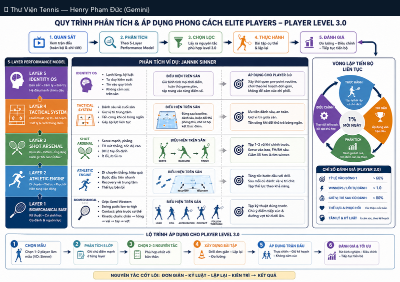

  <strong>Quy Trình Phân Tích & Áp Dụng Phong Cách Elite – Player Level 3.0 (Sinner Case Study) 🅖</strong>

  <em>Process for Analyzing & Applying Elite Player Style – Level 3.0 (Sinner Case Study)</em>

</a>

<a href="complete_tennis_system_technique_patterns_decisions/" class="gallery-card">

  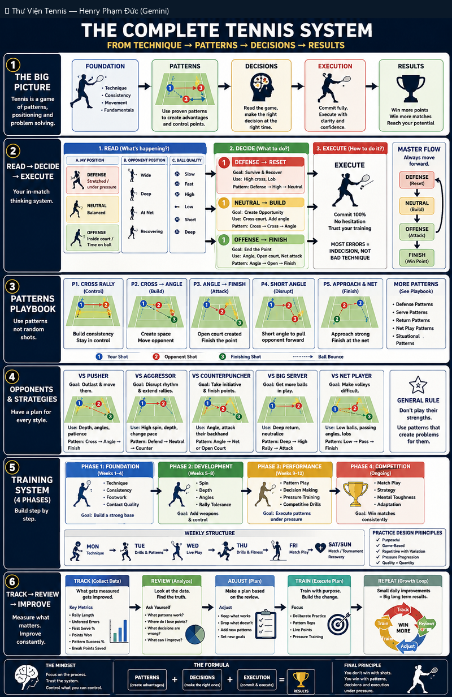

  <strong>Hệ Thống Tennis Hoàn Chỉnh: Kỹ Thuật → Patterns → Quyết Định → Kết Quả 🅖</strong>

  <em>Complete Tennis System: Technique → Patterns → Decisions → Results</em>

</a>

<a href="endurance_tennis_system_5_pillars/" class="gallery-card">

  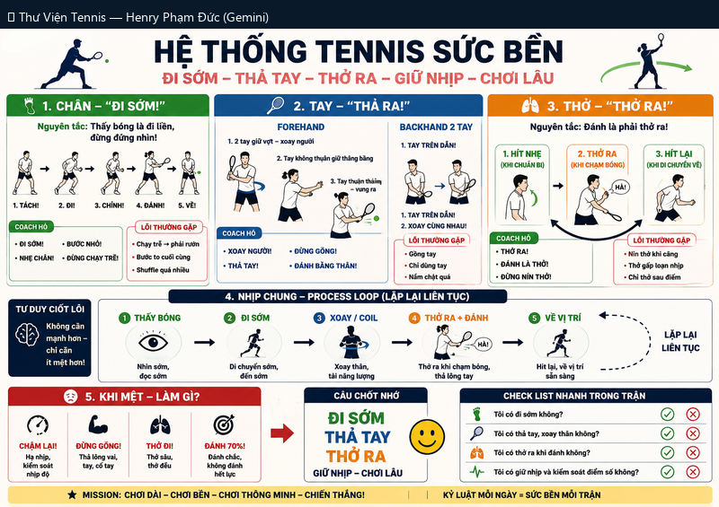

  <strong>Hệ Thống Tennis Sức Bền: 5 Trụ Cột (Chân · Tay · Thở · Nhịp · Mệt) 🅖</strong>

  <em>Endurance Tennis System: 5 Pillars (Legs · Arm · Breath · Rhythm · Fatigue)</em>

</a>

<a href="federer_adaptation_process_3_variables/" class="gallery-card">

  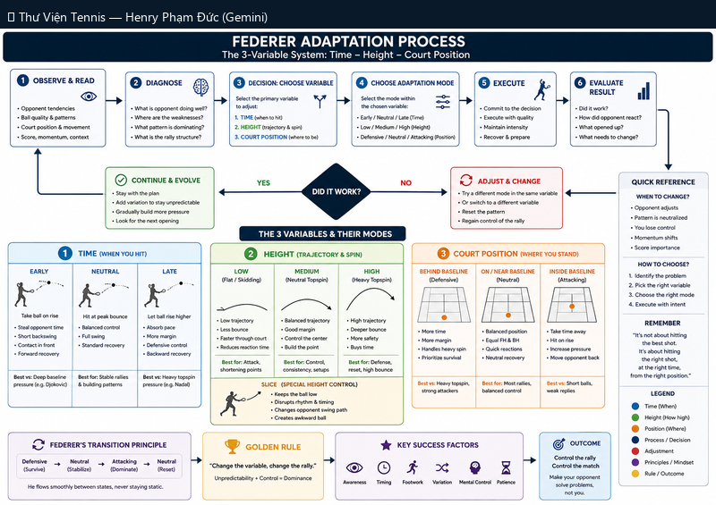

  <strong>Hệ Thống Thích Ứng Federer: Quy Trình Tennis Thích Ứng 🅖</strong>

  <em>Federer Adaptation System: The Adaptive Tennis Process</em>

</a>

<a href="federer_adaptive_system_full_loop/" class="gallery-card">

  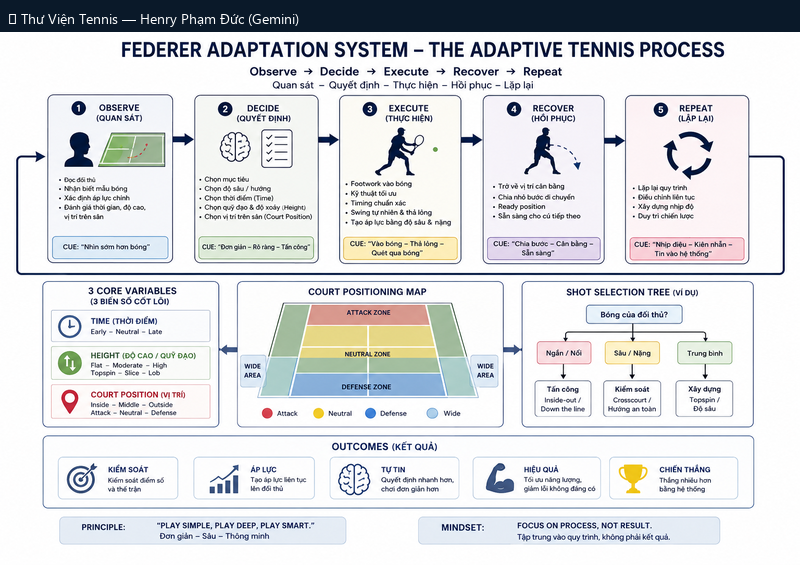

  <strong>Hệ Thống Thích Ứng Federer – Quy Trình Tennis Thích Ứng (Quan Sát → Quyết Định → Thực Hiện → Hồi Phục → Lặp Lại) 🅖</strong>

  <em>Federer Adaptive System – Adaptive Tennis Process (Observe → Decide → Execute → Recover → Repeat)</em>

</a>

<a href="federer_opponent_adaptation_3_variables/" class="gallery-card">

  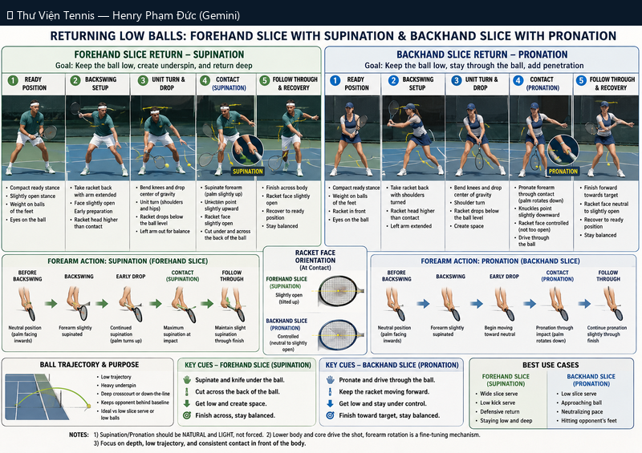

  <strong>Quy Trình Federer Thích Ứng Đối Thủ: 3 Biến Số (Thời Gian · Chiều Cao · Vị Trí Sân) 🅖</strong>

  <em>Federer Opponent Adaptation Process: 3 Variables (Time · Height · Court Position)</em>

</a>

<a href="federer_os_complete_process_diagram/" class="gallery-card">

  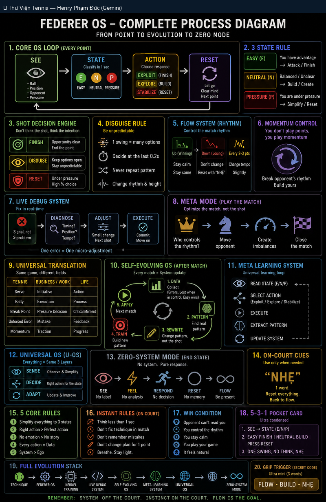

  <strong>Federer OS – Quy Trình Hoàn Chỉnh: Từ Point → Evolution → Zero Mode 🅖</strong>

  <em>Federer OS – Complete Process Diagram: From Point to Evolution to Zero Mode</em>

</a>

<a href="g_exposed_angles_geometry_court_control/" class="gallery-card">

  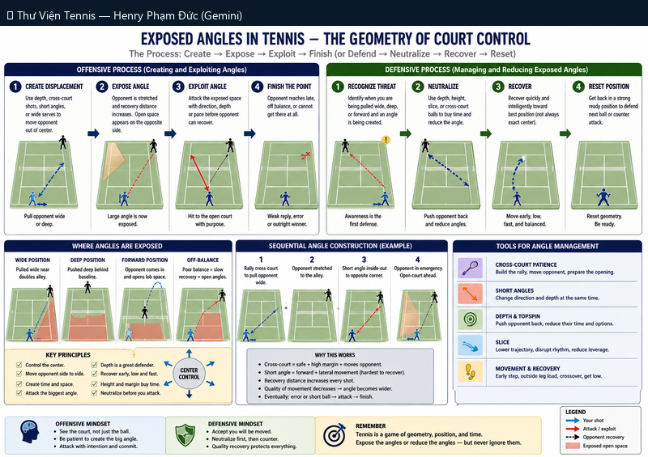

  <strong>Góc Mở Trong Tennis: Hình Học Của Kiểm Soát Sân 🅖</strong>

  <em>Exposed Angles in Tennis: The Geometry of Court Control</em>

</a>

<a href="playbook_doubles_3_complete_process/" class="gallery-card">

  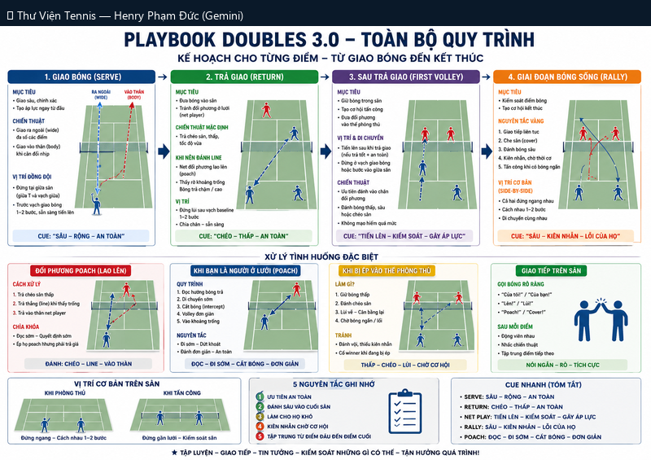

  <strong>Playbook Đánh Đôi 3.0 – Toàn Bộ Quy Trình (Từ Giao Bóng Đến Kết Thúc) 🅖</strong>

  <em>Doubles 3.0 Playbook – The Complete Process (From Serve to Finish)</em>

</a>

---

🅒 = ChatGPT · 🅖 = Gemini

## 🔗 Tài nguyên liên quan / Related Resources

- 📚 **[Tennis Ebook — Thư Viện Hoàn Chỉnh](https://henryphamduc.github.io/tennis/)** — 35+ tài liệu tennis song ngữ
- 📘 **[Tennis Manual (Master Reference v2)](https://henryphamduc.github.io/tennis/)** — 22 deep dives + cơ sinh học
- 🤖 **[Tennis Doctor — AI Chat](https://tennis-doctor.henry-phamduc.workers.dev/)** — Hỏi đáp tennis bằng AI
- 🎯 **[Cẩm nang Tennis (Wiki hub)](https://henryphamduc.github.io/tennis/)**

---

Tất cả sơ đồ được tạo từ AI image generators, watermarked & shipped by Henry Phạm Đức · 2026-06-29