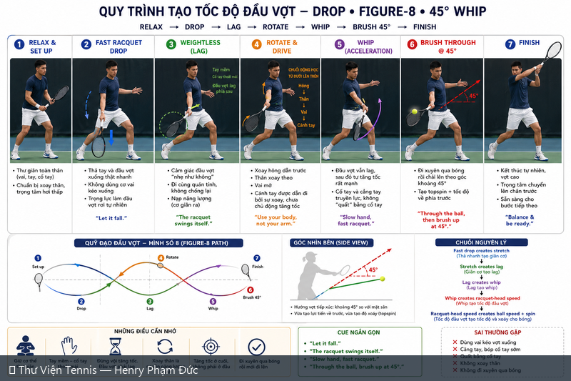
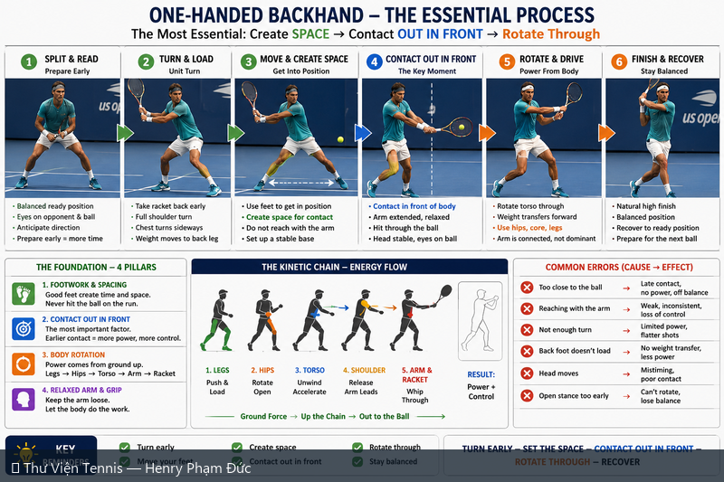
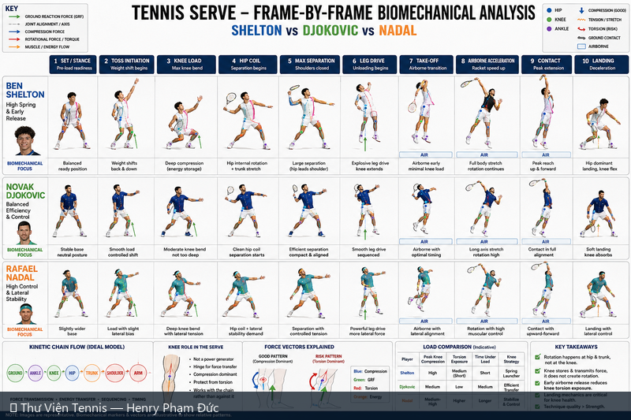
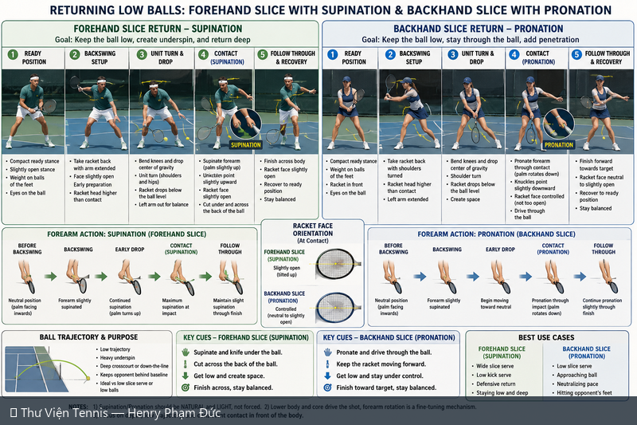
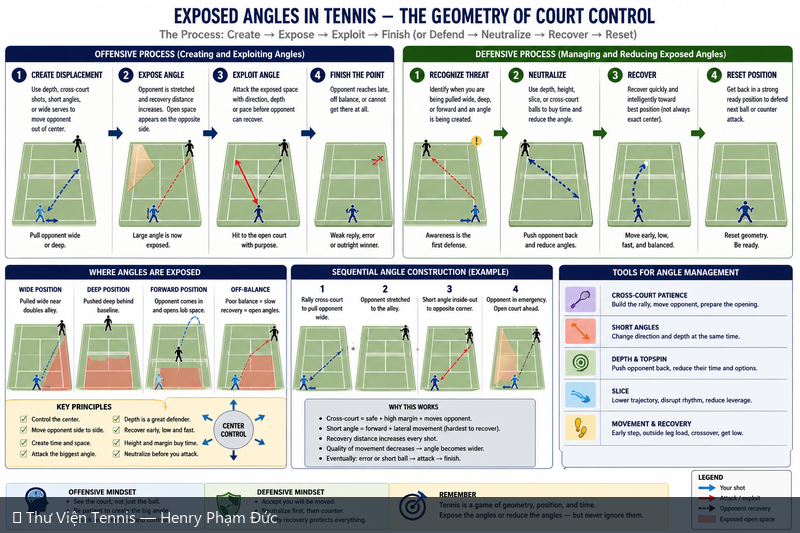
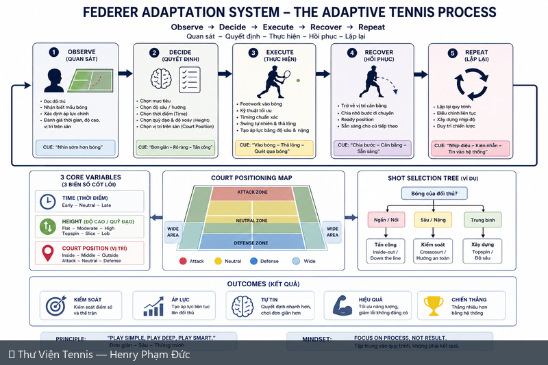

# 🎾 Thư Viện Hình Ảnh Tennis

> **Visual Coaching Library — 16 sơ đồ sinh học & chiến thuật tennis**
>
> Tổng hợp **16 sơ đồ infographic chất lượng cao** từ chuỗi nghiên cứu sinh học và chiến thuật tennis. Mỗi sơ đồ được gắn nhãn song ngữ **Tiếng Việt – Tiếng Anh**, với mô tả ngắn gọn về nội dung kỹ thuật. Click vào sơ đồ để xem ảnh gốc kích thước đầy đủ.

---

## 📊 Tổng quan

| 🇻🇳 Tiếng Việt | 🇺🇸 English |
|---|---|
| Thư viện **16 sơ đồ tennis** được sắp xếp theo **7 chủ đề**: forehand, backhand, serve, footwork, nền tảng, slice, chiến thuật. | Visual library of **16 tennis diagrams** organized into **7 categories**: forehand, backhand, serve, footwork, fundamentals, slice, strategy. |

**Sơ đồ được tạo qua ChatGPT Image Generator (2026-06-28 → 2026-06-29)** — phong cách infographic giáo dục với ảnh player minh họa, sơ đồ vector, và chú thích kỹ thuật EN-VI.

---

## 🗂️ Mục lục nhanh / Quick Navigation

- 🎯 **[Forehand (Thuận tay)](#forehand)** — Forehand (3 sơ đồ / diagrams)
- ↩️ **[Backhand (Trái tay)](#backhand)** — Backhand (3 sơ đồ / diagrams)
- 🚀 **[Serve (Giao bóng)](#serve)** — Serve (2 sơ đồ / diagrams)
- 🦶 **[Footwork (Bước chân)](#footwork)** — Footwork (2 sơ đồ / diagrams)
- ✋ **[Nền tảng kỹ thuật](#fundamentals)** — Fundamentals (1 sơ đồ / diagrams)
- 🔪 **[Slice (Bóng xoáy âm)](#slice)** — Slice (1 sơ đồ / diagrams)
- 🧠 **[Chiến thuật & Tư duy](#strategy)** — Strategy & Mental (4 sơ đồ / diagrams)

---

## 🎯 Forehand (Thuận tay) / Forehand

**3 sơ đồ — Forehand diagrams**

### 🎾 Quy Trình Hoàn Chỉnh: Cầm Vợt → Điểm Tiếp Xúc → Đường Vung → Xoáy → Quỹ Đạo
**Complete Process: Grip → Contact → Swing → Spin → Trajectory**

{ loading=lazy }

| 🇻🇳 Mô tả | 🇺🇸 Description |
|---|---|
| Phân tích sinh học toàn diện cho forehand. 8 phần: phổ grip (Continental → Western), điểm tiếp xúc (upper/center/lower), biomechanics lực đánh, swing path + mặt vợt, quỹ đạo bóng, so sánh chất lượng cú đánh, ví dụ tay vợt pro (Federer, Djokovic, Nadal, Alcaraz), tiến trình tập luyện. | Comprehensive biomechanical framework for forehand. 8 sections: grip spectrum, contact point, impact biomechanics, swing path + face relationship, ball trajectories, shot quality table, pro player examples, training progression. |

📂 **Xem file gốc / View source:** [assets/thu-vien/complete_process_forehand_biomechanics.png](../../../assets/thu-vien/complete_process_forehand_biomechanics.png)

---

### 🎾 Quy Trình Tạo Tốc Độ Đầu Vợt — Drop • Figure-8 • 45° Whip
**Racquet Head Speed Process — Drop • Figure-8 • 45° Whip**

{ loading=lazy }

| 🇻🇳 Mô tả | 🇺🇸 Description |
|---|---|
| Quy trình 7 bước tạo tốc độ đầu vợt cho topspin forehand hiện đại: Relax → Drop → Lag → Rotate → Whip → Brush 45° → Finish. Sơ đồ quỹ đạo Figure-8 + side view 45° + principle chain (Drop → Stretch → Lag → Whip → Speed → Ball). 6 cue ngắn: 'Let it fall', 'Slow hand, fast racquet', etc. | 7-step process for racquet head speed in modern topspin forehand. Figure-8 trajectory + 45° side view + principle chain. 6 short coaching cues. 5 common mistakes. |

📂 **Xem file gốc / View source:** [assets/thu-vien/racquet_head_speed_drop_figure8_45whip.png](../../../assets/thu-vien/racquet_head_speed_drop_figure8_45whip.png)

---

### 🎾 Động Cơ Xoay vs Động Cơ Tuyến — Open vs Closed Stance
**Rotational Engine vs Linear Engine — Open vs Closed Stance**

{ loading=lazy }

| 🇻🇳 Mô tả | 🇺🇸 Description |
|---|---|
| So sánh 2 cách tạo power cho forehand. Vế trái (xanh): Rotational/Open — Coil → Stretch → Uncoil → Whip. 10 bước với X-Factor (separation hips 45°/shoulders 90°). Vế phải (cam): Linear/Closed — Drive → Transfer → Extend → Finish. 8 bước với weight transfer. Decision matrix: Wide ball → Rotational, Short ball → Linear, Neutral → Hybrid. | 2 forehand power engines. Left (blue): Rotational/Open — Coil/Stretch/Uncoil/Whip. Right (orange): Linear/Closed — Drive/Transfer/Extend/Finish. Decision matrix for ball position. X-Factor concept explained. |

📂 **Xem file gốc / View source:** [assets/thu-vien/rotational_vs_linear_engine_open_vs_closed_stance.png](../../../assets/thu-vien/rotational_vs_linear_engine_open_vs_closed_stance.png)

---

## ↩️ Backhand (Trái tay) / Backhand

**3 sơ đồ — Backhand diagrams**

### 🎾 Backhand Một Tay — Quy Trình Cốt Lõi
**One-Handed Backhand — The Essential Process**

{ loading=lazy }

| 🇻🇳 Mô tả | 🇺🇸 Description |
|---|---|
| Hướng dẫn 6 bước backhand một tay. Split & Read → Turn & Load → Move & Create Space → Contact Out in Front → Rotate & Drive → Finish & Recover. 4 nền tảng (Footwork, Contact, Rotation, Relaxed Arm). 6 lỗi phổ biến. | 6-step one-handed backhand process. Foundation 4 pillars (Footwork, Contact, Body Rotation, Relaxed Arm). Kinetic chain energy flow. 6 common error corrections. |

📂 **Xem file gốc / View source:** [assets/thu-vien/one_handed_backhand_essential_process.png](../../../assets/thu-vien/one_handed_backhand_essential_process.png)

---

### 🎾 Master Backhand Hai Tay — Hệ Thống Cơ Sinh Học Hoàn Chỉnh
**Master Two-Handed Backhand — The Complete Biomechanical System**

{ loading=lazy }

| 🇻🇳 Mô tả | 🇺🇸 Description |
|---|---|
| 11 bước tuần tự: Split Step → Unit Turn → Take Back → Right Foot Forward (Bridge) → Body Drop → Torso Tension → Left Leg Drive → Left Hand Drive → Contact (close) → Extension → Finish. TBD Model: Bridge + Tension + Drive = Power. So sánh 1HBH vs 2HBH. Racket face rotation + Loose Right Hand (10-20%) / Strong Left Hand (80-90%). Lộ trình 6 tuần. | 11-step sequence. TBD Model: Bridge+Tension+Drive = Power. 1HBH vs 2HBH. Racket face rotation + hand roles (R 10-20% loose, L 80-90% strong). Low ball solution. 6-week training roadmap. |

📂 **Xem file gốc / View source:** [assets/thu-vien/master_two_handed_backhand_complete_system.png](../../../assets/thu-vien/master_two_handed_backhand_complete_system.png)

---

### 🎾 Cơ Sinh Học Backhand Hai Tay — Trình Tự Hoàn Chỉnh
**Two-Handed Backhand Biomechanics — Sequential Breakdown**

{ loading=lazy }

| 🇻🇳 Mô tả | 🇺🇸 Description |
|---|---|
| Khác với 'Master 2HBH' ở trên, đây là phân tích trình tự cơ sinh học (sequential) tập trung vào các pha riêng biệt: Preparation (3 bước) → Setup (1 bước) → Load/Tension (2 bước) → Acceleration/Release (5 bước). Kinetic chain ground-to-ball. Cùng công thức Bridge+Tension+Drive. | Sequential biomechanical breakdown (different from Master 2HBH above): Preparation (3) → Setup (1) → Load/Tension (2) → Acceleration/Release (5). Ground-to-ball kinetic chain. Bridge+Tension+Drive formula. |

📂 **Xem file gốc / View source:** [assets/thu-vien/two_handed_backhand_biomechanics_sequential.png](../../../assets/thu-vien/two_handed_backhand_biomechanics_sequential.png)

---

## 🚀 Serve (Giao bóng) / Serve

**2 sơ đồ — Serve diagrams**

### 🎾 Cẩm Nang Kỹ Thuật Giao Bóng — 4 Giai Đoạn Cốt Lõi
**Tennis Serve Manual — 4 Core Phases**

{ loading=lazy }

| 🇻🇳 Mô tả | 🇺🇸 Description |
|---|---|
| Cẩm nang chi tiết về cú giao bóng tennis. Triết lý: lực từ chân → hông → vai → tay → mặt vợt, không dùng lực delta đơn lẻ. 4 giai đoạn: Take Back (Coil) → Acceleration → Racket Down + Uncoil → Power Up. 3 loại bóng: Flat, Slice, Kick. Lời khuyên cho người 50+ (60% Slice + 30% Kick + 10% Flat). Tiến trình tập: Shadow → Toss isolation → Full. | Serve coaching manual. Kinetic chain philosophy. 4 phases: Coil → Acceleration → Racket Down + Uncoil → Power Up. 3 serve types (Flat/Slice/Kick). 50+ advice + distribution pie chart. 3-step drill progression. |

📂 **Xem file gốc / View source:** [assets/thu-vien/cam_nang_giao_bong_4_phases.png](../../../assets/thu-vien/cam_nang_giao_bong_4_phases.png)

---

### 🎾 Phân Tích Cú Giao Bóng Từng Khung Hình — Shelton vs Djokovic vs Nadal
**Tennis Serve Frame-by-Frame Biomechanics — Shelton vs Djokovic vs Nadal**

{ loading=lazy }

| 🇻🇳 Mô tả | 🇺🇸 Description |
|---|---|
| So sánh 3 tay vợt ATP qua 10 giai đoạn (Set → Toss → Knee Load → Hip Coil → Max Separation → Leg Drive → Take-off → Airborne → Contact → Landing). Shelton: High Spring. Djokovic: Balanced Efficiency. Nadal: Lateral Stability. Vai trò đầu gối (không tạo lực, là hinge truyền lực). Force vectors: compression vs torsion. | 3 ATP servers across 10 temporal phases. Shelton (Spring Launcher), Djokovic (Efficient Transfer), Nadal (Lateral Stability). Knee role (hinge, not power source). Compression vs torsion force vectors. |

📂 **Xem file gốc / View source:** [assets/thu-vien/tennis_serve_frame_by_frame_shelton_djokovic_nadal.png](../../../assets/thu-vien/tennis_serve_frame_by_frame_shelton_djokovic_nadal.png)

---

## 🦶 Footwork (Bước chân) / Footwork

**2 sơ đồ — Footwork diagrams**

### 🎾 Bước Chân & Chuỗi Động Lực — Toàn Bộ Quá Trình
**Footwork & Kinetic Chain — The Complete Process**

{ loading=lazy }

| 🇻🇳 Mô tả | 🇺🇸 Description |
|---|---|
| Infographic song ngữ EN-VI. 8 bước tuần tự: Ready → Split Step → Di chuyển → Tư thế vào bóng → Tạo lực → Tiếp xúc → Kết thúc → Phục hồi. 3 tư thế chủ đạo (Open cho forehand, Neutral, Closed cho backhand). Giải phẫu cơ chính (gluteus, hamstrings, calf, adductors, quadriceps). 5 nguyên tắc vàng. | Bilingual EN-VI infographic. 8-step sequence + 3 main stances + major muscle groups + kinetic chain flowchart + 5 drills + 6 golden rules for leg-driven groundstrokes. |

📂 **Xem file gốc / View source:** [assets/thu-vien/footwork_kinetic_chain_complete_process.png](../../../assets/thu-vien/footwork_kinetic_chain_complete_process.png)

---

### 🎾 Split Step — Quy Trình Hoàn Chỉnh
**Split Step — The Complete Process**

{ loading=lazy }

| 🇻🇳 Mô tả | 🇺🇸 Description |
|---|---|
| Split step footwork nền tảng. 8 giai đoạn: Read → Float → Land → Load → First Step → Move → Hit → Recover. Timing guide (split ~0.08s trước khi đối thủ tiếp xúc). Vị trí chân (11/1 o'clock, toes out). 5 sai lầm phổ biến. 5 bài tập cụ thể. | Foundational split-step footwork. 8 stages from Read to Recover. Timing guide (split ~0.08s before opponent contact). Foot position. 5 common mistakes. 5 practice drills. |

📂 **Xem file gốc / View source:** [assets/thu-vien/split_step_complete_process.png](../../../assets/thu-vien/split_step_complete_process.png)

---

## ✋ Nền tảng kỹ thuật / Fundamentals

**1 sơ đồ — Fundamentals diagrams**

### 🎾 Cầm Vợt – Xoay Cẳng Tay – Mặt Vợt: 4 Cú Đánh Chính
**Grip – Forearm Turn – Racquet Face for 4 Main Strokes**

{ loading=lazy }

| 🇻🇳 Mô tả | 🇺🇸 Description |
|---|---|
| Hệ thống hoàn chỉnh kiểm soát mặt vợt. Công thức cốt lõi: Grip + Forearm turn + Swing path = Mặt vợt tại tiếp xúc. Quy tắc FH vs BH đối lập (FH: more turn = closed more; BH: more turn = open more). 4 cú đánh: FH topspin, BH slice, FH slice, BH topspin. Bảng grip continuum (Eastern → Western). | Complete system for racquet face control. Core formula: Grip + Forearm turn + Swing path = Face at contact. FH and BH turn rules are opposite. 4 stroke combinations + grip continuum reference. 15-minute practice plan. |

📂 **Xem file gốc / View source:** [assets/thu-vien/grip_forearm_turn_racquet_face_4_strokes.png](../../../assets/thu-vien/grip_forearm_turn_racquet_face_4_strokes.png)

---

## 🔪 Slice (Bóng xoáy âm) / Slice

**1 sơ đồ — Slice diagrams**

### 🎾 Trả Bóng Thấp: FH Slice (Supination) & BH Slice (Pronation)
**Returning Low Balls: FH Slice (Supination) + BH Slice (Pronation)**

{ loading=lazy }

| 🇻🇳 Mô tả | 🇺🇸 Description |
|---|---|
| Hai cú slice trả bóng thấp. Vế trái: Forehand slice với supination cẳng tay — 5 bước (Ready → Backswing → Unit turn & drop → Contact (supination) → Follow through). Vế phải: Backhand slice với pronation — 5 bước tương tự. Sơ đồ cẳng tay 5 vị trí mỗi bên. Quỹ đạo bóng thấp + case sử dụng. | Two slice returns for low balls. Left (green): Forehand slice with supination — 5 steps + forearm diagram. Right (blue): Backhand slice with pronation — 5 steps + forearm diagram. Low ball trajectory + use cases. |

📂 **Xem file gốc / View source:** [assets/thu-vien/returning_low_balls_slice_supination_pronation.png](../../../assets/thu-vien/returning_low_balls_slice_supination_pronation.png)

---

## 🧠 Chiến thuật & Tư duy / Strategy & Mental

**4 sơ đồ — Strategy & Mental diagrams**

### 🎾 Hệ Thống Áp Lực Liên Hoàn — Cách ATP Tạo Lỗi & Thắng Điểm
**The Pressure Cascade System — How ATP Players Create Errors**

{ loading=lazy }

| 🇻🇳 Mô tả | 🇺🇸 Description |
|---|---|
| Hệ thống chiến thuật (không phải kỹ thuật đánh). Tạo áp lực 6 tầng: Position → Time → Decision → Execution → Weak Ball → Error/Winner. Flow charts + biomechanics cách bóng sâu tạo weak ball + ATP rally pattern + Mental cascade (áp lực vật lý → stress tâm lý → confidence drops → forced error). 5 input áp lực (Depth, Width, Height, Pace, Unpredictability). | Tactical framework (not a stroke). 6-tier cascade: Position → Time → Decision → Execution → Weak Ball → Error. Biomechanics of deep-ball damage + ATP rally pattern + mental cascade. 5 pressure inputs. |

📂 **Xem file gốc / View source:** [assets/thu-vien/pressure_cascade_atp_system.png](../../../assets/thu-vien/pressure_cascade_atp_system.png)

---

### 🎾 Hệ Thống Tennis Hoàn Chỉnh: Kỹ Thuật → Mẫu → Quyết Định → Kết Quả
**The Complete Tennis System: Technique → Patterns → Decisions → Results**

{ loading=lazy }

| 🇻🇳 Mô tả | 🇺🇸 Description |
|---|---|
| Hệ thống meta (không phải cú đánh cụ thể). Big picture: Foundation → Patterns → Decisions → Execution → Results. Read-Decide-Execute 3 cột. 5 mẫu chiến thuật chính (Cross rally, Cross→Angle, Angle→Finish, Short angle, Approach & Net). Chiến lược vs 5 đối thủ (Pusher, Aggressor, Counterpuncher, Big Server, Net Player). Hệ thống tập 4 pha. Track-Review-Improve loop. | Meta-system (not a stroke). Foundation → Patterns → Decisions → Execution → Results. 3-column Read/Decide/Execute. 5 core patterns. Strategy vs 5 opponent types. 4-phase training system. Track-Review-Improve loop. |

📂 **Xem file gốc / View source:** [assets/thu-vien/complete_tennis_system_technique_patterns_decisions_results.png](../../../assets/thu-vien/complete_tennis_system_technique_patterns_decisions_results.png)

---

### 🎾 Góc Mở Trong Tennis — Hình Học Kiểm Soát Sân
**Exposed Angles — The Geometry of Court Control**

{ loading=lazy }

| 🇻🇳 Mô tả | 🇺🇸 Description |
|---|---|
| Sơ đồ chiến thuật (không phải cú đánh). Quy trình tấn công 4 bước: Tạo khoảng cách → Phơi góc → Khai thác → Kết thúc. Quy trình phòng thủ: Nhận diện → Trung hòa → Hồi phục → Reset. 4 court diagrams (Wide/Deep/Forward/Off-balance). Sequential angle construction (rally 4-shot). | Tactical geometry (not a stroke). 4-step offensive process: Create → Expose → Exploit → Finish. 4-step defensive: Recognize → Neutralize → Recover → Reset. 4 court position diagrams + sequential angle example. |

📂 **Xem file gốc / View source:** [assets/thu-vien/exposed_angles_geometry_court_control.png](../../../assets/thu-vien/exposed_angles_geometry_court_control.png)

---

### 🎾 Hệ Thống Thích Nghi Federer — Quy Trình Thích Nghi Trong Tennis
**Federer Adaptation System — The Adaptive Tennis Process**

{ loading=lazy }

| 🇻🇳 Mô tả | 🇺🇸 Description |
|---|---|
| Quy trình tư duy 5 bước (song ngữ): Quan sát (Observe) → Quyết định (Decide) → Thực hiện (Execute) → Hồi phục (Recover) → Lặp lại (Repeat). 3 biến số cốt lõi: Time, Height, Court Position. Sơ đồ vùng sân (Attack/Neutral/Defense/Wide). Shot selection tree (Short/Medium/Deep). Nguyên tắc: Simple, Deep, Smart. | 5-step adaptive process (bilingual): Observe → Decide → Execute → Recover → Repeat. 3 core variables. Court position zones. Shot selection tree. Principle: Simple, Deep, Smart. |

📂 **Xem file gốc / View source:** [assets/thu-vien/federer_adaptation_adaptive_process.png](../../../assets/thu-vien/federer_adaptation_adaptive_process.png)

---

## 🔗 Tài nguyên liên quan / Related Resources

- 📚 **[Tennis Ebook — Thư Viện Hoàn Chỉnh](https://henryphamduc.github.io/tennis-wiki/cam-nang/ebook/)** — 35+ tài liệu tennis song ngữ đầy đủ
- 📘 **[Tennis Manual (Master Reference v2)](https://henryphamduc.github.io/tennis/)** — 22 deep dives + cơ sinh học
- 🤖 **[Tennis Doctor — AI Chat](https://tennis-doctor.henry-phamduc.workers.dev/)** — Hỏi đáp tennis bằng AI
- 🎯 **[Cẩm nang Tennis (Wiki hub)](../index.md)** — Quay về trang Cẩm nang
