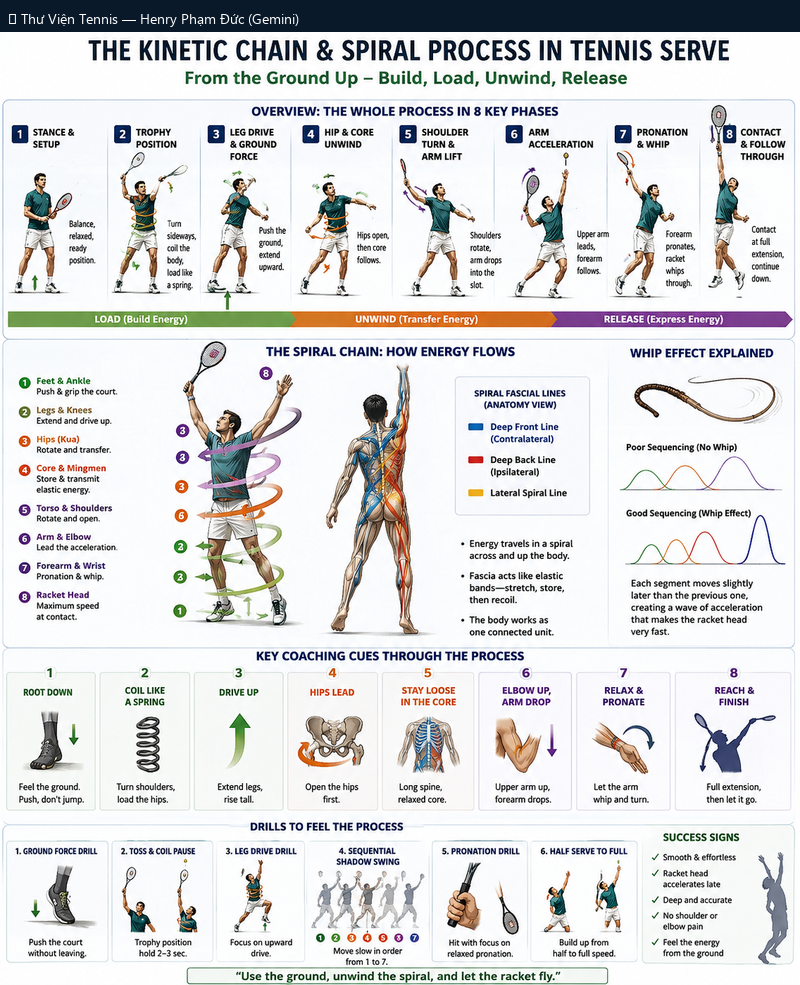

# Kinetic Chain & Spiral Process Trong Tennis Serve: Build → Load → Unwind → Release

> *Kinetic Chain & Spiral Process in Tennis Serve (Build → Load → Unwind → Release)*

**Chủ đề:** Serve · **Bộ sưu tập:** Thư Viện Hình Ảnh Tennis

---

## 📷 Sơ đồ đầy đủ / Full Diagram

📂 **[Xem file gốc / View source PNG](../../../assets/thu-vien/kinetic_chain_spiral_serve_ground_up.png)**

---

## 📝 Mô tả chi tiết / Detailed Description

| 🇻🇳 Tiếng Việt | 🇺🇸 English |
|---|---|
| 8 pha serve: Stance → Trophy → Leg Drive → Hip Unwind → Shoulder → Arm Acceleration → Pronation → Contact+Follow. 3 giai đoạn: LOAD → UNWIND → RELEASE. | 8-phase serve with kinetic chain + spiral process. |

---

## 🔗 Liên kết / Related Links

- ⬅️ **[← Quay lại Thư Viện Hình Ảnh](../index.md)**
- 🎯 **[Tổng quan Cẩm nang Tennis](../../index.md)**
- 📘 **[Tennis Manual (Master Reference v2)](https://henryphamduc.github.io/tennis/)**

---

Watermarked & shipped by Henry Phạm Đức · 2026-06-29
