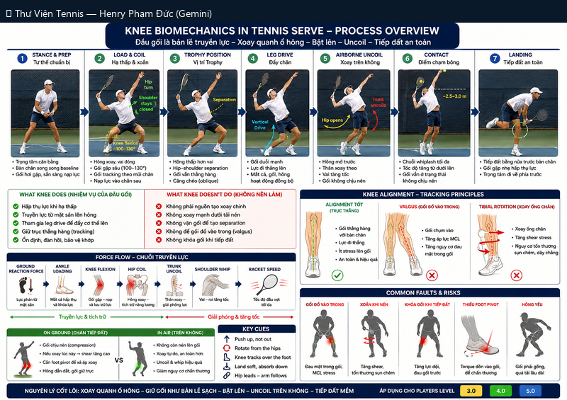

# Cơ Sinh Học Đầu Gối Trong Tennis Serve – Process Overview

> *Knee Biomechanics in Tennis Serve – Process Overview*

**Chủ đề:** Serve · **Bộ sưu tập:** Thư Viện Hình Ảnh Tennis

---

## 📷 Sơ đồ đầy đủ / Full Diagram

📂 **[Xem file gốc / View source PNG](../../../assets/thu-vien/knee_biomechanics_serve_process_overview.png)**

---

## 📝 Mô tả chi tiết / Detailed Description

| 🇻🇳 Tiếng Việt | 🇺🇸 English |
|---|---|
| 7 bước serve với vai trò đầu gối: Stance & Prep → Load & Coil → Trophy → Leg Drive → Airborne Uncoil → Contact → Landing. | 7-step serve with knee biomechanics focus. |

---

## 🔗 Liên kết / Related Links

- ⬅️ **[← Quay lại Thư Viện Hình Ảnh](../index.md)**
- 🎯 **[Tổng quan Cẩm nang Tennis](../../index.md)**
- 📘 **[Tennis Manual (Master Reference v2)](https://henryphamduc.github.io/tennis/)**

---

Watermarked & shipped by Henry Phạm Đức · 2026-06-29
