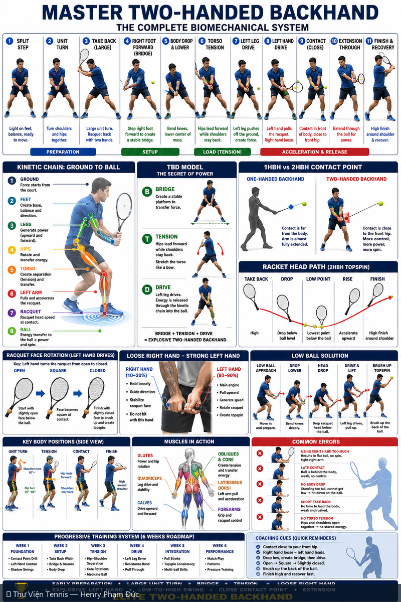

# Master Backhand Hai Tay — Hệ Thống Cơ Sinh Học Hoàn Chỉnh

> *Master Two-Handed Backhand — The Complete Biomechanical System*

**Chủ đề:** Backhand · **Nguồn:** ChatGPT Image Generator · **Bộ sưu tập:** Thư Viện Hình Ảnh Tennis

---

## 📷 Sơ đồ đầy đủ / Full Diagram

📂 **[Xem file gốc / View source PNG](../../../assets/thu-vien/master_two_handed_backhand_complete_system.png)**

---

## 📝 Mô tả chi tiết / Detailed Description

| 🇻🇳 Tiếng Việt | 🇺🇸 English |
|---|---|
| 11 bước tuần tự: Split Step → Unit Turn → Take Back → Right Foot Forward (Bridge) → Body Drop → Torso Tension → Left Leg Drive → Left Hand Drive → Contact (close) → Extension → Finish. TBD Model: Bridge + Tension + Drive = Power. So sánh 1HBH vs 2HBH. Racket face rotation + Loose Right Hand (10-20%) / Strong Left Hand (80-90%). Lộ trình 6 tuần. | 11-step sequence. TBD Model: Bridge+Tension+Drive = Power. 1HBH vs 2HBH. Racket face rotation + hand roles (R 10-20% loose, L 80-90% strong). Low ball solution. 6-week training roadmap. |

---

## 🔗 Liên kết / Related Links

- ⬅️ **[← Quay lại Thư Viện Hình Ảnh](../index.md)**
- 🎯 **[Tổng quan Cẩm nang Tennis](../../index.md)**
- 📘 **[Tennis Manual (Master Reference v2)](https://henryphamduc.github.io/tennis/)**

---

Sơ đồ được tạo từ ChatGPT Image Generator · Watermarked & shipped by Henry Phạm Đức · 2026-06-29
