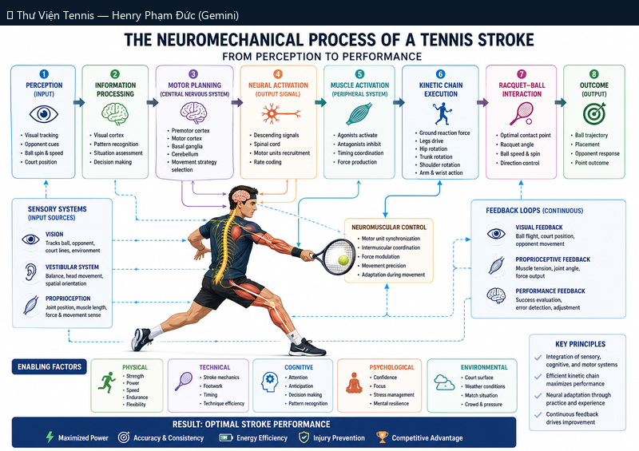

# Quá Trình Cơ Sinh Học Thần Kinh Của Cú Đánh Tennis

> *Neuromechanical Process of a Tennis Stroke (From Perception to Performance)*

**Chủ đề:** Fundamentals · **Bộ sưu tập:** Thư Viện Hình Ảnh Tennis

---

## 📷 Sơ đồ đầy đủ / Full Diagram

📂 **[Xem file gốc / View source PNG](../../../assets/thu-vien/neuromechanical_process_tennis_stroke.png)**

---

## 📝 Mô tả chi tiết / Detailed Description

| 🇻🇳 Tiếng Việt | 🇺🇸 English |
|---|---|
| 8 giai đoạn thần kinh-cơ: Perception → Information Processing → Motor Planning → Neural Activation → Muscle Activation → Kinetic Chain → Racquet-Ball Interaction → Outcome. | 8-stage neuromechanical pipeline. |

---

## 🔗 Liên kết / Related Links

- ⬅️ **[← Quay lại Thư Viện Hình Ảnh](../index.md)**
- 🎯 **[Tổng quan Cẩm nang Tennis](../../index.md)**
- 📘 **[Tennis Manual (Master Reference v2)](https://henryphamduc.github.io/tennis/)**

---

Watermarked & shipped by Henry Phạm Đức · 2026-06-29
