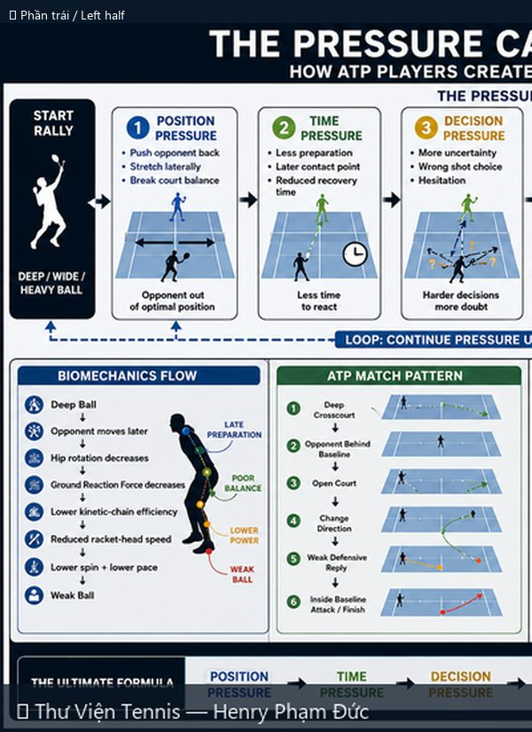
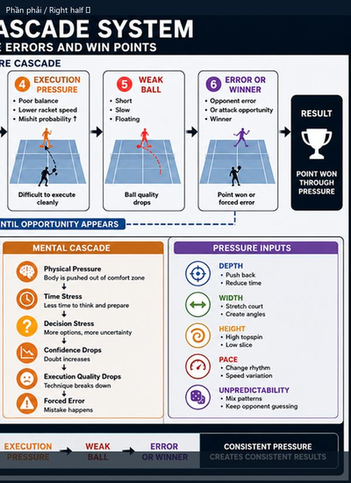

# Trả Bóng Thấp: FH Slice (Supination) & BH Slice (Pronation)

> *Returning Low Balls: FH Slice (Supination) + BH Slice (Pronation)*

**Chủ đề:** Slice · **Nguồn:** ChatGPT Image Generator · **Bộ sưu tập:** Thư Viện Hình Ảnh Tennis

---

## 📷 Sơ đồ đầy đủ / Full Diagram

📂 **[Xem file gốc / View source PNG](../../../assets/thu-vien/returning_low_balls_slice_supination_pronation.png)**

---

## 🔍 Zoom chi tiết / Detail Zoom

### Trái / Left half

### Phải / Right half

---

## 📝 Mô tả chi tiết / Detailed Description

| 🇻🇳 Tiếng Việt | 🇺🇸 English |
|---|---|
| Hai cú slice trả bóng thấp. Vế trái: Forehand slice với supination cẳng tay — 5 bước (Ready → Backswing → Unit turn & drop → Contact (supination) → Follow through). Vế phải: Backhand slice với pronation — 5 bước tương tự. Sơ đồ cẳng tay 5 vị trí mỗi bên. Quỹ đạo bóng thấp + case sử dụng. | Two slice returns for low balls. Left (green): Forehand slice with supination — 5 steps + forearm diagram. Right (blue): Backhand slice with pronation — 5 steps + forearm diagram. Low ball trajectory + use cases. |

---

## 🔗 Liên kết / Related Links

- ⬅️ **[← Quay lại Thư Viện Hình Ảnh](../index.md)**
- 🎯 **[Tổng quan Cẩm nang Tennis](../../index.md)**
- 📘 **[Tennis Manual (Master Reference v2)](https://henryphamduc.github.io/tennis/)**

---

Sơ đồ được tạo từ ChatGPT Image Generator · Watermarked & shipped by Henry Phạm Đức · 2026-06-29
