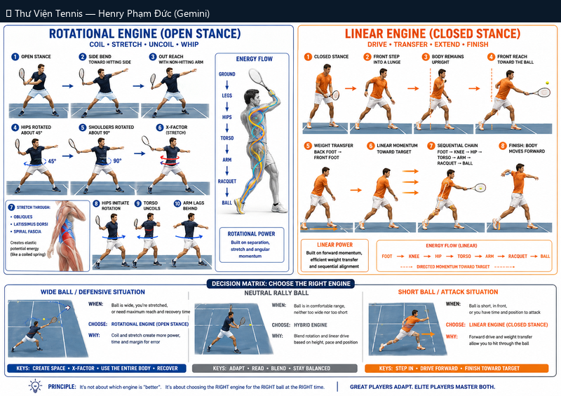

# Động Cơ Xoay vs Động Cơ Tuyến: Open Stance vs Closed Stance

> *Rotational Engine vs Linear Engine: Open Stance vs Closed Stance*

**Chủ đề:** Forehand · **Bộ sưu tập:** Thư Viện Hình Ảnh Tennis

---

## 📷 Sơ đồ đầy đủ / Full Diagram

📂 **[Xem file gốc / View source PNG](../../../assets/thu-vien/rotational_vs_linear_engine_open_vs_closed.png)**

---

## 📝 Mô tả chi tiết / Detailed Description

| 🇻🇳 Tiếng Việt | 🇺🇸 English |
|---|---|
| So sánh 2 động cơ tạo lực cho forehand: Rotational (coil-stretch-uncoil-whip, mở) vs Linear (drive-transfer-extend-finish, kín). Decision matrix theo tình huống bóng. | Comparison of 2 forehand power engines: Rotational (open stance) vs Linear (closed stance). Decision matrix by ball situation. |

---

## 🔗 Liên kết / Related Links

- ⬅️ **[← Quay lại Thư Viện Hình Ảnh](../index.md)**
- 🎯 **[Tổng quan Cẩm nang Tennis](../../index.md)**
- 📘 **[Tennis Manual (Master Reference v2)](https://henryphamduc.github.io/tennis/)**

---

Watermarked & shipped by Henry Phạm Đức · 2026-06-29
