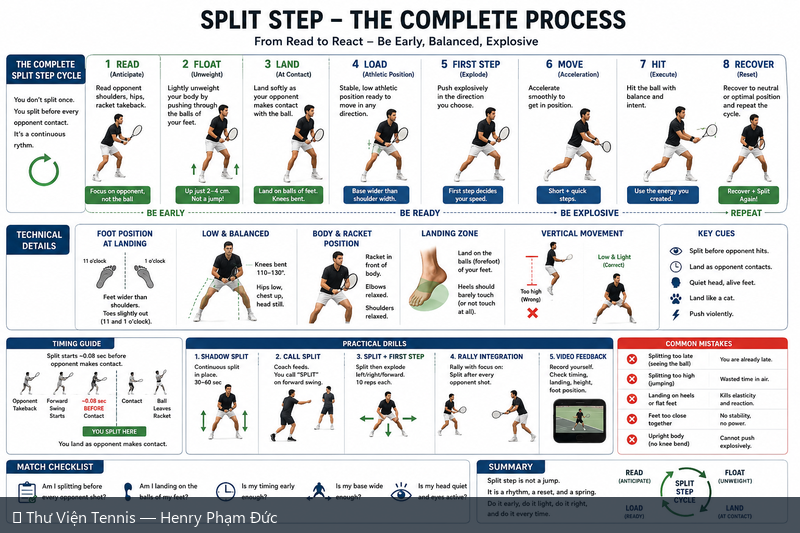
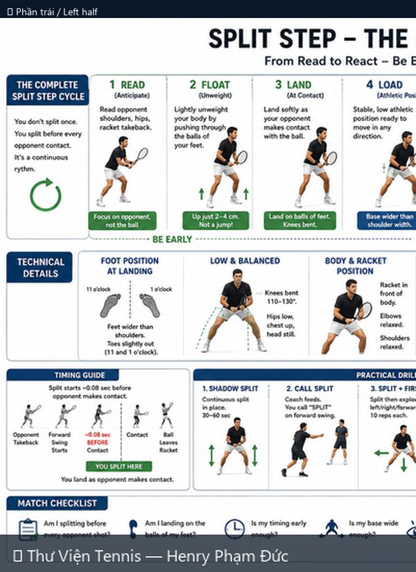
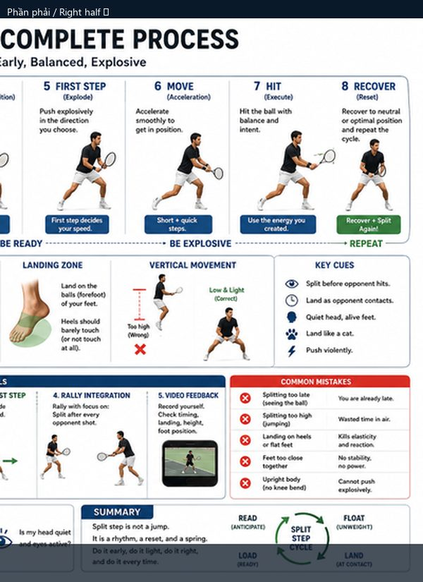

# Split Step — Quy Trình Hoàn Chỉnh

> *Split Step — The Complete Process*

**Chủ đề:** Footwork · **Nguồn:** ChatGPT Image Generator · **Bộ sưu tập:** Thư Viện Hình Ảnh Tennis

---

## 📷 Sơ đồ đầy đủ / Full Diagram

📂 **[Xem file gốc / View source PNG](../../../assets/thu-vien/split_step_complete_process.png)**

---

## 🔍 Zoom chi tiết / Detail Zoom

### Trái / Left half

### Phải / Right half

---

## 📝 Mô tả chi tiết / Detailed Description

| 🇻🇳 Tiếng Việt | 🇺🇸 English |
|---|---|
| Split step footwork nền tảng. 8 giai đoạn: Read → Float → Land → Load → First Step → Move → Hit → Recover. Timing guide (split ~0.08s trước khi đối thủ tiếp xúc). Vị trí chân (11/1 o'clock, toes out). 5 sai lầm phổ biến. 5 bài tập cụ thể. | Foundational split-step footwork. 8 stages from Read to Recover. Timing guide (split ~0.08s before opponent contact). Foot position. 5 common mistakes. 5 practice drills. |

---

## 🔗 Liên kết / Related Links

- ⬅️ **[← Quay lại Thư Viện Hình Ảnh](../index.md)**
- 🎯 **[Tổng quan Cẩm nang Tennis](../../index.md)**
- 📘 **[Tennis Manual (Master Reference v2)](https://henryphamduc.github.io/tennis/)**

---

Sơ đồ được tạo từ ChatGPT Image Generator · Watermarked & shipped by Henry Phạm Đức · 2026-06-29
