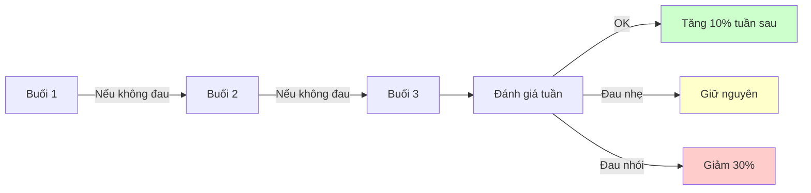

tiêu_đề: Nguyên tắc an toàn tuổi 52
bí_danh: [An toàn khớp, Joint safety, Surrey 52]
loại: hướng_dẫn
ngày_tạo: 2026-01-15
ngày_cập_nhật: 2026-01-15
trạng_thái: hoàn_thành
đối_tượng: Người chơi 50+ tại Surrey
khu_vực_đau: [#cổ_tay, #vai, #khuỷu_tay]
thuộc_về: "[Chương trình 4 tuần proprioception](../the-luc/chương-trình-4-tuần-proprioception.md)"
thẻ: [#an_toàn, #tuổi_52, #chấn_thương, #khớp, #surrey]

# Nguyên tắc an toàn tuổi 52

> Luyện "vật nhập thể" mà **không chấn thương** cổ tay và vai.

## 🚨 Quy tắc vàng

> **Đau nhói = DỪNG NGAY**

Không có bài tập nào đáng để đánh đổi sức khỏe khớp. Ở tuổi 52, khớp cần thời gian phục hồi dài hơn, và một chấn thương có thể đẩy lùi tiến trình hàng tháng.

## Cổ tay

### ✅ Làm

- Giữ cổ tay **trung tính** trong mọi bài tập
- Để **vai và thân xoay** làm việc thay vì lắc cổ tay
- **Choke-up** khi cần kiểm soát — giảm moment quán tính
- Khởi động bằng **vẩy cổ tay nhẹ** trước khi cầm vợt

### ❌ Tránh

- Lắc cổ tay chủ động
- Gồng cổ tay khi block
- Đánh big swing khi chưa khởi động

### 🔍 Dấu hiệu cảnh báo

- Đau nhói buổi sáng hôm sau = **tải quá nặng**, giảm 30% khối lượng
- Tê/ngứa ngón tay = **cầm vợt quá chặt**, thả lỏng
- Viêm mạn tính = nghỉ 1 tuần, tham khảo bác sĩ

## Vai

### ✅ Làm

- **Wall angels** 10 lần trước mỗi buổi — kích hoạt rotator cuff
- Kéo ngoài xoay vai với **dây kháng lực nhẹ**
- Giữ **scapula ổn định** (xương bả vai không nhô lên)
- Bài tì tường 20s × 3 — kích hoạt cơ dưới vai không cần gồng

### ❌ Tránh

- Serve hoặc overhead khi vai mỏi
- Big swing khi chưa warm-up
- Đứng trên đệm/bosu khi đau vai

### 🔍 Dấu hiệu cảnh báo

- Đau khi giơ tay ngang = có thể viêm rotator cuff → nghỉ + tham khảo bác sĩ
- "Click" khi xoay vai = cần khởi động kỹ hơn

## Khởi động chuẩn (5 phút)

| Thứ tự | Bài                     | Thời gian |
| ------ | ----------------------- | --------- |
| 1      | Xoay vai nhỏ, mỗi chiều | 30s       |
| 2      | Xoay vai lớn, mỗi chiều | 30s       |
| 3      | Vẩy cổ tay nhẹ          | 30s       |
| 4      | Wall angels             | 10 lần    |
| 5      | Đi bộ nhẹ + vung tay    | 2 phút    |

## Nguyên tắc tải

Khi nào cần dừng hẳn
--------------------

* ⚠️ Đau khớp kéo dài > 48h sau buổi tập
* ⚠️ Sưng, nóng, đỏ quanh khớp
* ⚠️ Mất sức cầm nắm đột ngột
* ⚠️ Tê/ngứa kéo dài không hết sau 30 phút nghỉ

→ Trong các trường hợp trên: nghỉ 1 tuần + tham khảo bác sĩ thể thao tại Surrey.
Phục hồi
--------

* Ngủ đủ giấc — myelin hóa xảy ra chủ yếu khi ngủ
* Hydrate — dây thần kinh cần nước để dẫn truyền
* Ăn đủ đạm — phục hồi cơ và dây chằng
* Massage nhẹ / foam roll cổ tay + vai sau buổi tập

* * *

📌 Liên kết:

* 🏋️ [Chương trình 4 tuần proprioception](../the-luc/chương-trình-4-tuần-proprioception.md)
* ⬆️ [Proprioception vs Sức mạnh](../the-luc/proprioception-vs-sức-mạnh.md)
