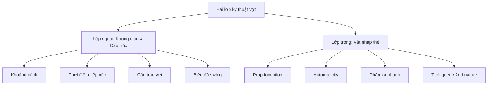

# 🗺️ Bản đồ nội dung

> MOC (Map of Content) — điểm vào chính để điều hướng vault.

## 🎓 Tầng 1 — Nền tảng khái niệm

* [Hai lớp kỹ thuật vợt](../ky-thuat/hai-lớp-kỹ-thuật-vợt.md) ⭐ _bắt đầu ở đây_
* [Lớp ngoài - Không gian & Cấu trúc](../ky-thuat/lớp-ngoài---không-gian-&-cấu-trúc.md)
* _Lớp trong - Vật nhập thể_
* [Proprioception vs Sức mạnh](proprioception-vs-sức-mạnh.md)

💪 Tầng 2 — Áp dụng thực hành
-----------------------------

* [Chương trình 4 tuần proprioception](chương-trình-4-tuần-proprioception.md)
* [Nguyên tắc an toàn tuổi 52](../ky-thuat/nguyên-tắc-an-toàn-tuổi-52.md)

📚 Tầng 3 — Nguồn tham khảo
---------------------------

* [Nghiên cứu tham khảo](../ky-thuat/nghiên-cứu-tham-khảo.md)

🔗 Liên kết theo chủ đề
-----------------------

### Về proprioception

* [Proprioception vs Sức mạnh](proprioception-vs-sức-mạnh.md) — tại sao phản xạ không phụ thuộc vào cơ bắp
* _Lớp trong - Vật nhập thể_ — cơ chế thần kinh của việc "cảm" vợt

### Về cổ tay / vai

* [Nguyên tắc an toàn tuổi 52](../ky-thuat/nguyên-tắc-an-toàn-tuổi-52.md) — bảo vệ khớp khi luyện
* _Chương trình 4 tuần proprioception#Tuần 1_ — bài tập khởi đầu

### Về bài tập theo không gian

* _Lớp ngoài - Không gian & Cấu trúc#Khoảng cách từ người tới bóng_
* _Chương trình 4 tuần proprioception#Tuần 2 – Thay đổi đòn bẩy_

