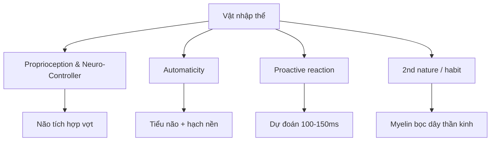

# Lớp trong: Vật nhập thể (Racquet Embodiment)

> Phần **không nhìn thấy** của cú đánh. Lý do hai người cùng cấu trúc bên ngoài lại đánh khác nhau hoàn toàn.

## Bốn từ khóa cốt lõi

. Proprioception & Neuro-Controller
-----------------------------------

Não bộ có "bản đồ cơ thể" (body schema). Khi cầm vợt đủ lâu, não không còn coi vợt là vật ngoài, mà tích hợp nó thành phần mở rộng của cánh tay.

* Lúc đó đầu vợt có "cảm giác" như đầu ngón tay
* Bạn biết mặt vợt đang mở hay đóng mà không cần nhìn

> 💡 Người mới phải "nhìn vợt", người giỏi chỉ "cảm bóng".

→ Xem thêm: [Proprioception vs Sức mạnh](proprioception-vs-sức-mạnh.md)

2. Automaticity — No need to think

----------------------------------

* Lớp 1 đòi hỏi suy nghĩ: "bóng xa → lùi chân → cầm dài → big swing"
* Lớp 2 xóa bỏ bước đó

Não chuyển từ:

* ❌ Vỏ não trước trán (lập kế hoạch) — chậm
* ✅ Tiểu não + hạch nền (thói quen) — nhanh

Kết quả: Cú đánh trở thành phản xạ.

3. Fast reaction — Proactive instead

------------------------------------

Khi vợt đã là một phần cơ thể:

* ❌ Không còn "phản ứng" với bóng
* ✅ Bạn "dự đoán"

Hệ thần kinh dự báo quỹ đạo 100-150ms trước khi bóng tới, và tay đã di chuyển.

4. 2nd nature / Habit

---------------------

> Quá trình này không đến từ việc đánh nhiều, mà đến từ việc lặp lại đúng cấu trúc không gian (lớp 1) hàng ngàn lần.

Mỗi lần lặp:

* Myelin bọc quanh dây thần kinh dày lên
* Tín hiệu truyền nhanh hơn
* Não chọn đúng cấu trúc mà không cần lệnh

Tương quan Lớp 1 ↔ Lớp 2
------------------------

mermaid

graph LR
    A[Lớp 1: Phần cứng] -->|Cài đặt cấu trúc| B[Lớp 2: Phần mềm]
    B -->|3-6 tháng lặp lại| C[Não tự chọn cấu trúc đúng]
    C --> D[Không cần ra lệnh]
    style A fill:#ffe4b5
    style B fill:#b0e0e6
    style C fill:#90ee90
    style D fill:#dda0dd

| Lớp   | Vai trò     | Hành động                                                  |
| ----- | ----------- | ---------------------------------------------------------- |
| Lớp 1 | "Phần cứng" | Dạy cơ thể: khoảng cách nào → compact, bóng nào → choke up |
| Lớp 2 | "Phần mềm"  | Sau 3-6 tháng, não tự chọn cấu trúc đúng                   |

Cách tách buổi tập
------------------

* 20 phút "ngoài": thay đổi grip + khoảng cách, không cần bóng nhanh
* 30 phút "trong": rally chậm, mắt nhắm 1 giây trước tiếp xúc → ép não dùng proprioception thay vì thị giác

* * *

📌 Liên kết:

* ⬆️ [Hai lớp kỹ thuật vợt](../ky-thuat/hai-lớp-kỹ-thuật-vợt.md)
* ⬅️ [Lớp ngoài - Không gian & Cấu trúc](../ky-thuat/lớp-ngoài---không-gian-&-cấu-trúc.md)
* ➡️ [Proprioception vs Sức mạnh](proprioception-vs-sức-mạnh.md)
* 🏋️ [Chương trình 4 tuần proprioception](chương-trình-4-tuần-proprioception.md)
